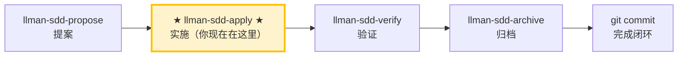

# LLMAN SDD Apply

使用此 skill 在**一个闭环内**按顺序完成 `llmanspec/changes/<id>/tasks.md` 的所有任务：
实现代码 → 补测试/验收 → 跑门禁 → 失败自修复并重跑 → 全部通过后报告结果。
除非遇到明确 blocker，否则**不要中途停下来问「要不要继续」**。

## Pipeline 位置



> 📍 你现在在实施阶段 → 完成本阶段后下一步 `llman-sdd-verify`（验证）

## 硬约束

- **SSOT 驱动**：以 `proposal.md` / `design.md` / `tasks.md` / `specs/` 为唯一事实来源；specs 中的 MUST/SHALL 必须逐条落实。
- **范围锁定**：只实现当前 change 的范围；禁止顺手修「无关问题」。
- **最小改动**：改动保持最小并严格围绕当前 tasks。
- **禁止猜测**：需求不明确、specs 与实现矛盾时，先 STOP 并报告，不要自行假定行为。
- **不保留旧兼容层**：若 change 要求改行为，直接全量升级到新写法，除非 tasks/proposal 明确写了要兼容。
- **不要问「要不要继续」**：除非遇到无法自动解决的 blocker，否则一路执行到闭环结束。

## 步骤

### 0) Preflight（必须做）
- 读取并遵守：`llmanspec/config.yaml`、`AGENTS.md`（若存在）。
- `git status --porcelain`：
  - 若工作区不干净且改动不属于当前 change：先 `git stash push -u -m "llman-sdd-apply autopilot backup"` 做备份。
- 运行 `llman sdd validate --all --strict --no-interactive`：
  - 若失败且与当前 change 无关，先停下报告（工件不一致会导致实现无法以 SSOT 驱动）。
- **检查 spec valid_scope 完整性**：使用 `llman sdd list --specs --json` 列出所有 spec，然后对每个 spec 验证其 `valid_scope` 中的每个路径是否存在于磁盘上。若存在缺失的文件/目录，停下并建议更新 spec（从 `valid_scope` 中移除已删除的路径）。

### 1) 选择变更 id 并检查前置条件
- 若已提供 change id，直接使用。
- 否则从上下文推断；若不明确，运行 `llman sdd list --json` 并让用户选择。
- 始终说明："使用变更：<id>"，并告知如何覆盖。

- 检查阶段守卫：
  ```bash
  llman sdd show <id> --json --type change
  ```
  - `draft`：变更尚未准备好实现 → STOP，提示先用 `llman-sdd-propose` 完善到至少 `spec` 阶段。
  - `specified` / `designed` / `full`：通过，继续。
- 使用 `llman sdd context --task "<proposal 中的目标>" --paths "<specs 中的 scope>"` 获取相关 specs。
  - 若 context 不可用，运行 `llman sdd index rebuild` 后重试。

### 2) 阅读 SSOT 工件
必须通读以下文件：
- `llmanspec/changes/<id>/proposal.md`
- `llmanspec/changes/<id>/design.md`（如存在）
- `llmanspec/changes/<id>/tasks.md`

- `llmanspec/changes/<id>/specs/**`


将 `proposal.md` 和 `design.md` 中的决策整理为不可违反的硬约束清单。把 `tasks.md` 转成可执行的最小步骤序列（保持原顺序）。

### 3) 展示状态
- 进度："N/M tasks complete"
- 接下来 1–3 个未完成任务（简短概览）

### 4) 逐任务实施（闭环执行）
对每个未完成 task：
1. **实现**：严格按 task 描述 + specs 要求，改动保持最小。
2. **完成后立刻更新 checkbox**：`- [ ]` → `- [x]`。
3. 若 task 不明确、遇到 blocker、或发现 specs/design 与现实不一致 → STOP 并报告 blocker，不要自行假定。

> 💡 上一阶段 `llman-sdd-propose`（已生成 tasks）；完成本阶段后 → `llman-sdd-verify`（验证）

### 5) 验证与自修复循环（每个 task 或每批 task 完成后执行一次）
运行项目门禁命令（根据项目实际选择）：
- 相关测试集：`just test` 或 `cargo test --all`
- 格式/lint：`just check` 或 `just lint` + `just fmt`

- SDD 校验：`llman sdd validate <id> --strict --no-interactive`

**若失败 → 进入自修复循环（不要问要不要继续）：**
1. 解析失败原因（测试失败 / lint / 格式 / 校验错误）。
2. 进行最小修复（不扩大范围）。
3. 先重跑「最小失败复现命令」，再重跑全部门禁。
4. 记录为一轮自修复：`Round N：失败点 → 修复 → 重跑 → 通过/失败`。

**自修复上限 8 轮**；超过仍不通过视为 blocker：停止并输出 blocker 报告（含最后一次失败命令与输出摘要、你已尝试的修复）。

### 6) 完成报告
所有 task 完成 + 全部门禁通过后，输出结构化报告（见下方 Output Contract）。
然后建议运行 `llman-sdd-verify` 进入验证阶段。

> 💡 实施完成 → 下一步 `llman-sdd-verify`（验证）

行动前先阅读 `llmanspec/config.yaml`，并遵循其中的 `context` 与 `rules`（若有）。

常用命令：
- `llman sdd context --task "<描述>" --paths "<文件>"`（找相关 specs）。使用 pageindex agentic tree 后端（需 `LLMAN_SDD_INDEX_CHAT_MODEL`）。可用 `LLMAN_SDD_INDEX_BACKEND` 预设。
- `llman sdd list`（列出变更）
- `llman sdd list --specs`（列出 specs 及 purpose/scope 元数据）
- `llman sdd show <id>`（展示 change/spec）
- `llman sdd validate <id>`（校验 change 或 spec）
- `llman sdd validate --all`（批量校验）
- `llman sdd index rebuild`（重建 pageindex 树索引——不需要模型）
- `llman sdd index check`（检查索引新鲜度）
- `llman sdd change new <id>`（创建草稿 `changes/<id>/proposal.md`）
- `llman sdd change attach <id> [--force]`（BDD-on：绑定 feature 分支 + base SHA）
- `llman sdd change checkpoint <id> [--no-check]`（BDD-on：干净工作区 + 归档前门禁）
- `llman sdd change diff <id> [--export-patch <path>]`（BDD-on：只读 `base...HEAD` 审查/导出）
- `llman sdd change delta …`（仅 BDD-off：TOON delta 作者工具；BDD-on 会拒绝）
- `llman sdd change archive <id>`（封存变更；BDD-on：checkpoint 后仅文档；BDD-off：合并 TOON delta）
- `llman sdd archive freeze [--before YYYY-MM-DD] [--keep-recent N] [--dry-run]`（冻结已归档目录）
- `llman sdd archive thaw [--change <id> ...] [--dest <path>]`（从冷备份恢复）
- `llman sdd graph [CHANGE] [--format mermaid] [--scope active|archived|all] [--depth N]`（生成变更依赖图）
- `llman sdd project migrate [--kind format|partitioned|legacy-bdd|auto]`（一次性迁移）


## Context
- 执行前先确认当前 change/spec 状态。
- 优先使用 `llman sdd context --task --paths` 获取相关 specs，而非全量读取或猜测。
- 这是实现阶段：此时 proposal/specs/tasks 已就绪，只负责落地。

## Goal
- 在一个闭环内完成所有 tasks 实现 + 验证 + 自修复，产出全绿门禁结果。

## Constraints
- 变更保持最小化且范围明确。
- 标识符或意图不明确时禁止猜测。
- 禁止中途停下来问「要不要继续」；遇到 blocker 才 STOP。
- 行为合约变更必须走完整 SDD 流程（本 skill 仅处理已到 apply 阶段的变更）。

## Workflow
- 以 `llman sdd` 命令结果为事实来源。
- 涉及文件/规范变更时执行校验。
- 首选 `llman sdd context` 获取相关 specs，而非全量读取或猜测。
- 当 context 不可用时，按错误提示处理（重建 index 或降级到 `list --specs --json`）。
- 实现 → 验证 → 失败 → 自修复 → 重验证 → 直到通过或超过 8 轮。

## Decision Policy
- 高影响歧义必须先澄清。
- 已知校验错误下禁止强行继续。
- 自修复仅限最小改动，不得扩大范围。

## Output Contract
所有 tasks 完成后（或遇到 blocker 时）必须输出：
- **实现摘要**：列出完成的 task 及关键改动文件。
- **验证命令与结果**：逐条列出你实际运行过的命令 + 关键输出/通过结论。
- **自修复轮次**：每轮：`Round N：失败点 → 修复 → 重跑命令 → 是否通过`。
- **校验状态**：`llman sdd validate <id> --strict --no-interactive` 的结果。
- **残留风险/已知不确定性**：含未能自动解决的事项。
- **下一步建议**：建议运行 `llman-sdd-verify` 进入验证阶段。

## Ethics Governance
- `ethics.risk_level`：按 `low|medium|high|critical` 标注风险等级。
- `ethics.prohibited_actions`：列出绝对禁止执行的动作。
- `ethics.required_evidence`：列出高影响输出前必须具备的证据。
- `ethics.refusal_contract`：定义何时拒答以及安全替代响应方式。
- `ethics.escalation_policy`：定义何时必须升级为用户确认/人工复核。
