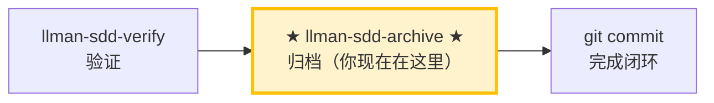

# LLMAN SDD 归档

使用此 skill 归档已完成的变更。**BDD-off**：合并 delta specs 到主 specs。**BDD-on**：仅移动 change 文档（specs 已在 feature 分支上 live），再经 Git/PR merge 提升。

## Pipeline 位置



> 📍 你现在在归档阶段：pipeline 最后一站。
> 📎 若 specs 逐渐膨胀，可运行 `llman-sdd-specs-compact` 压缩。

## 硬约束

- **必须先通过 verify 阶段全绿**：未通过验证的 change 禁止归档。
- **SSOT 校验**：每个 change 归档前必须通过 `llman sdd validate <id> --strict --no-interactive`。
- **不要问「要不要继续」**：批量归档时间线上一路执行到底，除非遇到无法自动解决的错误。

## 步骤

### 0) Preflight
- `git status --porcelain`：确认工作区改动属于已完成的 change。
- 若有未预期改动，先处理（stash 或报告）。

### 1) 确认目标变更
- 确定目标 ID：单个或批量（来自用户输入或 `llman sdd list --json`）。
- 始终说明："归档 IDs：<id1>, <id2>, ..."。
- 确认每个 change 都已通过 verify 阶段的全绿验证。

### 2) 逐个归档
- 先逐个校验：`llman sdd validate <id> --strict --no-interactive`。
- 校验失败 → STOP 并报告；不要跳过校验强行归档。
- 可选预览：`llman sdd change archive <id> --dry-run`。
- 执行归档：
  - 默认：`llman sdd change archive <id>`
  - 仅工具类变更：`llman sdd change archive <id> --skip-specs`
  - **任一失败立即停止**，报告剩余未处理 ID。
- **BDD-on（Git-native Partitioned SSOT）**：
  - 前置：已 `llman sdd change attach <id>`，再 `llman sdd change checkpoint <id>`（干净工作区 + 门禁），仍在 feature 分支上。
  - `change archive` **只移动 change 文档**到 `changes/archive/`——**不会**把 TOON delta 当 SSOT 合并，也永不 apply `feature_delta`。
  - change 下遗留活跃 `*.feature.delta.toon` 是迁移阻断项——归档前须移除/迁移。
  - 归档后，通过正常 Git/PR 将 feature 分支合并进默认分支，以提升 live `llmanspec/specs/**`。
- **BDD-off**：
  - `change archive` 按今日流程将 change 内 TOON delta 合并进主 `spec.toon`。
  - 不要求 attach / checkpoint / feature 分支 / harness。

### 3) 全量校验
- 全部归档完成后执行：`llman sdd validate --all --strict --no-interactive`。
- 确认归档后的 specs 工件一致。

### 4) Commit / merge 引导
- BDD-off：输出建议 commit message（格式：`feat(sdd): archive <id1>, <id2> - <简短总结>`），然后 `git add -A && git commit -m "..."`。
- BDD-on：文档归档后，打开/合并 feature 分支 PR，使 live specs/features 进入默认分支。
- 若用户要求自动 commit 归档文档提交，执行后输出 commit hash。

> 💡 上一阶段 `llman-sdd-verify`（验证通过）→ 本阶段归档后闭环结束。若 specs 逐渐膨胀，可运行 `llman-sdd-specs-compact` 压缩。

## Archive 冷备引导
- 当 archive 目录增长过大时，使用冷备维护：
  - 预览冻结候选：`llman sdd archive freeze --dry-run`
  - 冻结旧归档：`llman sdd archive freeze --before <YYYY-MM-DD> --keep-recent <N>`
  - 需要恢复时：`llman sdd archive thaw --change <YYYY-MM-DD-id>`
- freeze/thaw 仅用于日期归档目录（`YYYY-MM-DD-*`）；建议保留少量最近目录不冻结。


行动前先阅读 `llmanspec/config.yaml`，并遵循其中的 `context` 与 `rules`（若有）。

常用命令：
- `llman sdd context --task "<描述>" --paths "<文件>"`（找相关 specs）。使用 pageindex agentic tree 后端（需 `LLMAN_SDD_INDEX_CHAT_MODEL`）。可用 `LLMAN_SDD_INDEX_BACKEND` 预设。
- `llman sdd list`（列出变更）
- `llman sdd list --specs`（列出 specs 及 purpose/scope 元数据）
- `llman sdd show <id>`（展示 change/spec）
- `llman sdd validate <id>`（校验 change 或 spec）
- `llman sdd validate --all`（批量校验）
- `llman sdd index rebuild`（重建 pageindex 树索引——不需要模型）
- `llman sdd index check`（检查索引新鲜度）
- `llman sdd change new <id>`（创建草稿 `changes/<id>/proposal.md`）
- `llman sdd change attach <id> [--force]`（BDD-on：绑定 feature 分支 + base SHA）
- `llman sdd change checkpoint <id> [--no-check]`（BDD-on：干净工作区 + 归档前门禁）
- `llman sdd change diff <id> [--export-patch <path>]`（BDD-on：只读 `base...HEAD` 审查/导出）
- `llman sdd change delta …`（仅 BDD-off：TOON delta 作者工具；BDD-on 会拒绝）
- `llman sdd change archive <id>`（封存变更；BDD-on：checkpoint 后仅文档；BDD-off：合并 TOON delta）
- `llman sdd archive freeze [--before YYYY-MM-DD] [--keep-recent N] [--dry-run]`（冻结已归档目录）
- `llman sdd archive thaw [--change <id> ...] [--dest <path>]`（从冷备份恢复）
- `llman sdd graph [CHANGE] [--format mermaid] [--scope active|archived|all] [--depth N]`（生成变更依赖图）
- `llman sdd project migrate [--kind format|partitioned|legacy-bdd|auto]`（一次性迁移）


常见校验修复（TOON 独立文件 spec）：

1) 缺少校验作用域（`Spec valid_scope must not be empty`）：
Main spec 必须在 `.toon` 文档内携带非空的 `valid_scope`。
`llmanspec/specs/<feature-id>/spec.toon`：
```toon
kind: llman.sdd.spec
name: sample
purpose: "One-line overview."
valid_scope[1]: src
requirements[1]{req_id,title,statement}:
  r1,Title,System MUST do something.
scenarios[1]{req_id,id,given,when,then}:
  r1,happy,"",a trigger happens,the outcome is observed
```

2) Change 缺少 delta ops：至少补一个 op + scenario（`llmanspec/changes/<change-id>/specs/<feature-id>/spec.toon`）：
```toon
kind: llman.sdd.delta
ops[1]{op,req_id,title,statement,from,to,name}:
  add_requirement,r1,Title,System MUST do something.,null,null,null
op_scenarios[1]{req_id,id,given,when,then}:
  r1,happy,"",a trigger happens,the outcome is observed
```

3) 表格化行引号错误（"Expected N tabular row values, but got M"）：
值包含**空格**、逗号、冒号或方括号时，必须用双引号包裹。
```toon
# 错误：未加引号的空格值会被拆成多个值
r1,happy,"",a trigger happens,the outcome is observed

# 正确：多词值加引号
r1,happy,"","a trigger happens","the outcome is observed"
```

4) BDD-on 护栏（Git-native Partitioned SSOT）：
`config.yaml` 有 `bdd:` 时：`spec.toon`=约束/不可执行场景；`*.feature`=可执行 GWT（`@req`）。在非默认分支编辑 live 文件 → `change attach` / `checkpoint` → docs-only `change archive` → Git merge。不要找 solidify，也不要新建 `*.feature.delta.toon`（若已存在则是迁移阻断，跑 `project migrate --kind partitioned`）。空 requirements 且无 `.feature` = ERROR。

备注：
- 每个 spec 是一个独立的 `.toon` 文件；没有 Markdown 外壳，也没有 ```toon fence。
- `null` 表示可选字段缺失。
- 从旧版 `.md`+fence 迁移请使用 `llman sdd migrate`。


## Context
- 执行前先确认当前 change/spec 状态。
- 优先使用 `llman sdd context --task --paths` 获取相关 specs，而非全量读取或猜测。

## Goal
- 明确本次命令/skill 要达成的可验证结果。

## Constraints
- 变更保持最小化且范围明确。
- 标识符或意图不明确时禁止猜测。
- 在读取 spec 全文前，先使用 `llman sdd context --task --paths` 获取相关 specs。
- 判断变更规模后选择路径：行为合约变更走完整 SDD 流程，实现变更走快速路径。

## Workflow
- 以 `llman sdd` 命令结果为事实来源。
- 涉及文件/规范变更时执行校验。
- 首选 `llman sdd context` 获取相关 specs，而非全量读取或猜测。
- 当 context 不可用时，按错误提示处理（重建 index 或降级到 `list --specs --json`）。

## Decision Policy
- 高影响歧义必须先澄清。
- 已知校验错误下禁止强行继续。

## Output Contract
- 汇总已执行动作。
- 给出结果路径与校验状态。

## Ethics Governance
- `ethics.risk_level`：按 `low|medium|high|critical` 标注风险等级。
- `ethics.prohibited_actions`：列出绝对禁止执行的动作。
- `ethics.required_evidence`：列出高影响输出前必须具备的证据。
- `ethics.refusal_contract`：定义何时拒答以及安全替代响应方式。
- `ethics.escalation_policy`：定义何时必须升级为用户确认/人工复核。
