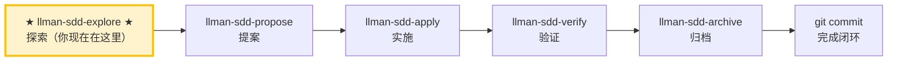

# LLMAN SDD Explore

当用户希望在开始实现之前先理清思路、调查问题或澄清需求时，使用此 skill。

**重要：探索模式只用于思考，不用于实现。**
- 你可以阅读文件、搜索代码、调查代码库。
- 如果用户需要，你可以创建/更新 llman SDD artifacts（proposal/specs/design/tasks）。
- 你绝对不能在探索模式下写应用代码或实现功能。

## Pipeline 位置

> 📍 你现在在探索阶段（仅思考）→ 常规路径下一步 `llman-sdd-propose`（提案）
> 📎 如果是小改动（不改行为合约），可直接走 `llman-sdd-quick`（快速路径）

## 探索姿态
- 好奇而不教条
- 以真实代码为依据
- 需要时用 ASCII 图可视化
- 同时保留多个选项与权衡

## 建议动作
1. 使用 `llman sdd context --task "<任务>" --paths "<文件>"` 快速定位相关 specs。
   - 阅读 context 的 `direct` 列出的 spec 全文（这些是必须理解的合约）。
   - 如果 context 不可用，运行 `llman sdd index rebuild`（默认 `pageindex`，无需模型）后重试。
2. 澄清目标与约束（问 1–3 个问题）。
3. 如果某个 change id 相关，阅读 `llmanspec/changes/<id>/` 下的 artifacts。
4. 探索 2–3 个选项与权衡。
5. 判断变更规模（triage），确定是否需要走完整 SDD 流程。
6. 当结论逐渐清晰时，建议用户把它记录下来（不要自动写入）：
   - 范围变化 → `proposal.md`
   - 需求变化 → `llmanspec/changes/<id>/specs/<capability>/spec.toon`
   - 设计决策 → `design.md`
   - 新工作项 → `tasks.md`

## 退出探索模式
当用户准备开始实现时，根据变更规模选择路径：
- 行为合约变更 → `llman-sdd-propose`（创建提案工件）
- 小改动 / 不改合约 → `llman-sdd-quick`（快速路径）
- 已有完整 change 工件 → `llman-sdd-apply`（按 tasks 实施）
若用户在探索模式中要求你开始实现，STOP 并提醒其先退出探索模式。

> 💡 探索完成 → 下一步 `llman-sdd-propose`（保单）或 `llman-sdd-quick`（快速路径）

在执行之前，请先阅读 `llmanspec/config.yaml`，若其中包含 `context` 与 `rules` 请遵循。

常用命令：
- `llman sdd context --task "<description>" --paths "<files>"`（获取相关 specs）。使用 pageindex agentic 树检索后端（需配置 `LLMAN_SDD_INDEX_CHAT_MODEL`）。可用 `LLMAN_SDD_INDEX_BACKEND` 预设。
- `llman sdd list`（列出变更）
- `llman sdd list --specs`（列出 specs，含 purpose/scope 元数据）
- `llman sdd show <id>`（查看 change/spec）
- `llman sdd validate <id>`（校验变更或 spec）
- `llman sdd validate --all`（批量校验）
- `llman sdd index rebuild`（重建 pageindex 树索引——无需模型）
- `llman sdd index check`（检查索引新鲜度）
- `llman sdd archive run <id>`（归档变更）
- `llman sdd archive freeze [--before YYYY-MM-DD] [--keep-recent N] [--dry-run]`（冻结归档目录）
- `llman sdd archive thaw [--change <id> ...] [--dest <path>]`（解冻归档）
- `llman sdd graph [CHANGE] [--format mermaid] [--scope active|archived|all] [--depth N]`（生成变更依赖图）

## Context
- 执行前先确认当前 change/spec 状态。
- 优先使用 `llman sdd context --task --paths` 获取相关 specs，而非全量读取或猜测。

## Goal
- 明确本次命令/skill 要达成的可验证结果。

## Constraints
- 变更保持最小化且范围明确。
- 标识符或意图不明确时禁止猜测。
- 在读取 spec 全文前，先使用 `llman sdd context --task --paths` 获取相关 specs。
- 判断变更规模后选择路径：行为合约变更走完整 SDD 流程，实现变更走快速路径。

## Workflow
- 以 `llman sdd` 命令结果为事实来源。
- 涉及文件/规范变更时执行校验。
- 首选 `llman sdd context` 获取相关 specs，而非全量读取或猜测。
- 当 context 不可用时，按错误提示处理（重建 index 或降级到 `list --specs --json`）。

## Decision Policy
- 高影响歧义必须先澄清。
- 已知校验错误下禁止强行继续。

## Output Contract
- 汇总已执行动作。
- 给出结果路径与校验状态。

## Ethics Governance
- `ethics.risk_level`：按 `low|medium|high|critical` 标注风险等级。
- `ethics.prohibited_actions`：列出绝对禁止执行的动作。
- `ethics.required_evidence`：列出高影响输出前必须具备的证据。
- `ethics.refusal_contract`：定义何时拒答以及安全替代响应方式。
- `ethics.escalation_policy`：定义何时必须升级为用户确认/人工复核。