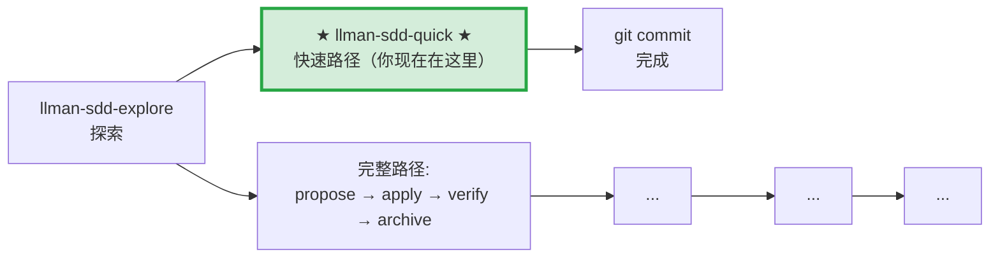

# LLMAN SDD Quick Path

对于不涉及行为合约变更的小改动使用此路径。

## Pipeline 位置

> 📍 快速路径：不改行为合约，直接改代码 commit。如果发现需要改合约 → STOP，改走完整路径 `llman-sdd-propose`

## 使用条件（所有条件必须满足）
- 不改变任何 spec 中 MUST/SHALL 定义的外部可观测行为
- 不涉及跨 capability 的修改
- 不涉及迁移/兼容性
- 不是 SDD 元规范变更

## 步骤
1. 用 `llman sdd context --task "..." --paths "..."` 确认无相关 spec 变更需要。
   - 如果 context 返回 `quality: "unavailable"`，运行 `llman sdd index rebuild`（默认 `pageindex`，无需模型）。
   - 可以用 `llman sdd list --specs --json` 查看 specs 元数据。
2. 直接修改代码。
3. 如果涉及 spec 的维护性调整（修错字、收紧 scope），直接编辑 spec 文件并用 `llman sdd validate --specs` 校验。
4. git commit（message 写明 why）。
5. 无需 change 目录，无需 archive。

## 边界处理
- 如果在修改中发现需要改变行为合约 → STOP，改走 `llman-sdd-propose`（完整路径）。
- 如果涉及到多个文件且不确定 scope → 先用 `llman sdd context` 确认。

> 💡 快速路径完成 → git commit 即可。若需要走完整路径 → `llman-sdd-propose` → `llman-sdd-apply` → `llman-sdd-verify` → `llman-sdd-archive`

行动前先阅读 `llmanspec/config.yaml`，并遵循其中的 `context` 与 `rules`（若有）。

常用命令：
- `llman sdd context --task "<描述>" --paths "<文件>"`（找相关 specs）。使用 pageindex agentic tree 后端（需 `LLMAN_SDD_INDEX_CHAT_MODEL`）。可用 `LLMAN_SDD_INDEX_BACKEND` 预设。
- `llman sdd list`（列出变更）
- `llman sdd list --specs`（列出 specs 及 purpose/scope 元数据）
- `llman sdd show <id>`（展示 change/spec）
- `llman sdd validate <id>`（校验 change 或 spec）
- `llman sdd validate --all`（批量校验）
- `llman sdd index rebuild`（重建 pageindex 树索引——不需要模型）
- `llman sdd index check`（检查索引新鲜度）
- `llman sdd change new <id>`（创建草稿 `changes/<id>/proposal.md`）
- `llman sdd change attach <id> [--force]`（BDD-on：绑定 feature 分支 + base SHA）
- `llman sdd change checkpoint <id> [--no-check]`（BDD-on：干净工作区 + 归档前门禁）
- `llman sdd change diff <id> [--export-patch <path>]`（BDD-on：只读 `base...HEAD` 审查/导出）
- `llman sdd change delta …`（仅 BDD-off：TOON delta 作者工具；BDD-on 会拒绝）
- `llman sdd change archive <id>`（封存变更；BDD-on：checkpoint 后仅文档；BDD-off：合并 TOON delta）
- `llman sdd archive freeze [--before YYYY-MM-DD] [--keep-recent N] [--dry-run]`（冻结已归档目录）
- `llman sdd archive thaw [--change <id> ...] [--dest <path>]`（从冷备份恢复）
- `llman sdd graph [CHANGE] [--format mermaid] [--scope active|archived|all] [--depth N]`（生成变更依赖图）
- `llman sdd project migrate [--kind format|partitioned|legacy-bdd|auto]`（一次性迁移）

## Context
- 执行前先确认当前 change/spec 状态。
- 优先使用 `llman sdd context --task --paths` 获取相关 specs，而非全量读取或猜测。

## Goal
- 明确本次命令/skill 要达成的可验证结果。

## Constraints
- 变更保持最小化且范围明确。
- 标识符或意图不明确时禁止猜测。
- 在读取 spec 全文前，先使用 `llman sdd context --task --paths` 获取相关 specs。
- 判断变更规模后选择路径：行为合约变更走完整 SDD 流程，实现变更走快速路径。

## Workflow
- 以 `llman sdd` 命令结果为事实来源。
- 涉及文件/规范变更时执行校验。
- 首选 `llman sdd context` 获取相关 specs，而非全量读取或猜测。
- 当 context 不可用时，按错误提示处理（重建 index 或降级到 `list --specs --json`）。

## Decision Policy
- 高影响歧义必须先澄清。
- 已知校验错误下禁止强行继续。

## Output Contract
- 汇总已执行动作。
- 给出结果路径与校验状态。

## Ethics Governance
- `ethics.risk_level`：按 `low|medium|high|critical` 标注风险等级。
- `ethics.prohibited_actions`：列出绝对禁止执行的动作。
- `ethics.required_evidence`：列出高影响输出前必须具备的证据。
- `ethics.refusal_contract`：定义何时拒答以及安全替代响应方式。
- `ethics.escalation_policy`：定义何时必须升级为用户确认/人工复核。
