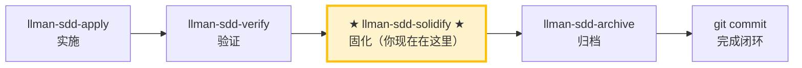

# LLMAN SDD Solidify

使用此 skill 为某个 change 生成（重新生成）可执行的 `.feature` 文件，来源是其 delta `spec.toon` 中的 scenarios。仅 BDD-on 项目。

## Pipeline 位置



> 📍 你现在在 solidify 阶段：verify 通过之后、archive 之前。
> BDD-off 项目：此命令为 no-op（无内容可生成）。

## 硬约束

- **BDD 模式感知**——先检查 `llmanspec/config.yaml` 是否含 `bdd:` 段，再分支：
  - **BDD-on**（有 `bdd:` 段）：正常执行 solidify（见下方步骤）。
  - **BDD-off，且 `llmanspec/specs/` 下无任何 `.feature` 文件**：no-op。报告「无需固化（BDD 未启用）」。
  - **BDD-off，但存在 `.feature` 文件**：报告**残留警告**——列出每个文件并说明：「发现 N 个 `.feature` 文件，但 BDD 未启用（`config.yaml` 无 `bdd:` 段）。它们会被 `validate`/`index` 忽略。若要重新启用可执行性，请添加 `bdd:` 段（如 `bdd:\n  run_command: \"cargo test --features bdd\"`）。有意重新启用，还是不再需要则删除？」**禁止删除这些文件**——只展示，由用户决定。
- **框架无关**：solidify 不扫描 `tests/bdd_steps.rs` 或任何 BDD 框架的 step 绑定。scenario 是否在运行时「可执行」由 `bdd.run_command` 判定。
- **禁止手工编辑 `.feature`**：它们是生成产物。改 `spec.toon` 的 scenarios，再重新运行 solidify。
- **不要问「要不要继续」**：一路执行到底，除非遇到无法自动解决的错误。

## 步骤

### 1) 确认目标 change
- 确定 change id（来自用户输入或上下文）。
- 始终说明："固化的变更：<id>"。
- `spec.toon` 是 SSOT。`.feature` 文件是其 scenarios 的**可执行子集**，序列化为 Gherkin。
- 当 scenario 的 `when` 调用 `llman sdd validate|archive|solidify` 时为**自指递归**，会被跳过（否则 BDD runner 会递归 spawn）。

### 2)（可选）Dry-run 预览
- `llman sdd solidify <id> --dry-run` 预览哪些 scenario 写入、哪些跳过。
- 检查跳过原因：`feature=false` 与自指 scenario 的跳过是预期的。

### 3) 执行 solidify
- `llman sdd solidify <id>`
- 会为每个 capability 在 `llmanspec/specs/<capability>/<capability>.feature` 写入一个文件。

### 4) 报告
- 汇总：每个 capability 写入/跳过的 scenario 数量，及输出路径。
- 跳过的 scenario 列出原因。

> 💡 上一阶段 `llman-sdd-verify`（已通过）→ 本阶段生成 `.feature` → 下一步 `llman-sdd-archive`（归档）。

在执行之前，请先阅读 `llmanspec/config.yaml`，若其中包含 `context` 与 `rules` 请遵循。

常用命令：
- `llman sdd context --task "<description>" --paths "<files>"`（获取相关 specs）。使用 pageindex agentic 树检索后端（需配置 `LLMAN_SDD_INDEX_CHAT_MODEL`）。可用 `LLMAN_SDD_INDEX_BACKEND` 预设。
- `llman sdd list`（列出变更）
- `llman sdd list --specs`（列出 specs，含 purpose/scope 元数据）
- `llman sdd show <id>`（查看 change/spec）
- `llman sdd validate <id>`（校验变更或 spec）
- `llman sdd validate --all`（批量校验）
- `llman sdd index rebuild`（重建 pageindex 树索引——无需模型）
- `llman sdd index check`（检查索引新鲜度）
- `llman sdd archive run <id>`（归档变更）
- `llman sdd archive freeze [--before YYYY-MM-DD] [--keep-recent N] [--dry-run]`（冻结归档目录）
- `llman sdd archive thaw [--change <id> ...] [--dest <path>]`（解冻归档）
- `llman sdd graph [CHANGE] [--format mermaid] [--scope active|archived|all] [--depth N]`（生成变更依赖图）


常见校验修复（TOON 独立文件 spec）：

1) 缺少校验作用域（`Spec valid_scope must not be empty`）：
Main spec 必须在 `.toon` 文档内携带非空的 `valid_scope`。
`llmanspec/specs/<feature-id>/spec.toon`：
```toon
kind: llman.sdd.spec
name: sample
purpose: "One-line overview."
valid_scope[1]: src
requirements[1]{req_id,title,statement}:
  r1,Title,System MUST do something.
scenarios[1]{req_id,id,given,when,then}:
  r1,happy,"",a trigger happens,the outcome is observed
```

2) Change 缺少 delta ops：至少补一个 op + scenario（`llmanspec/changes/<change-id>/specs/<feature-id>/spec.toon`）：
```toon
kind: llman.sdd.delta
ops[1]{op,req_id,title,statement,from,to,name}:
  add_requirement,r1,Title,System MUST do something.,null,null,null
op_scenarios[1]{req_id,id,given,when,then}:
  r1,happy,"",a trigger happens,the outcome is observed
```

3) 表格化行引号错误（"Expected N tabular row values, but got M"）：
值包含**空格**、逗号、冒号或方括号时，必须用双引号包裹。
```toon
# 错误：未加引号的空格值会被拆成多个值
r1,happy,"",a trigger happens,the outcome is observed

# 正确：多词值加引号
r1,happy,"","a trigger happens","the outcome is observed"
```

4) BDD spec 护栏（`BDD is enabled but this spec declares no requirements and has no .feature files`）：
当 `config.yaml` 含 `bdd` 块时，行为规格在 `spec.toon` 的 `scenarios` 中（TOON 是唯一真源）。`.feature` 文件由 `llman sdd solidify` 衍生生成。`requirements` 和 `scenarios` 均为空的 spec 是 ERROR。

备注：
- 每个 spec 是一个独立的 `.toon` 文件；没有 Markdown 外壳，也没有 ```toon fence。
- `null` 表示可选字段缺失。
- 从旧版 `.md`+fence 迁移请使用 `llman sdd migrate`。


## Context
- 执行前先确认当前 change/spec 状态。
- 优先使用 `llman sdd context --task --paths` 获取相关 specs，而非全量读取或猜测。

## Goal
- 明确本次命令/skill 要达成的可验证结果。

## Constraints
- 变更保持最小化且范围明确。
- 标识符或意图不明确时禁止猜测。
- 在读取 spec 全文前，先使用 `llman sdd context --task --paths` 获取相关 specs。
- 判断变更规模后选择路径：行为合约变更走完整 SDD 流程，实现变更走快速路径。

## Workflow
- 以 `llman sdd` 命令结果为事实来源。
- 涉及文件/规范变更时执行校验。
- 首选 `llman sdd context` 获取相关 specs，而非全量读取或猜测。
- 当 context 不可用时，按错误提示处理（重建 index 或降级到 `list --specs --json`）。

## Decision Policy
- 高影响歧义必须先澄清。
- 已知校验错误下禁止强行继续。

## Output Contract
- 汇总已执行动作。
- 给出结果路径与校验状态。

## Ethics Governance
- `ethics.risk_level`：按 `low|medium|high|critical` 标注风险等级。
- `ethics.prohibited_actions`：列出绝对禁止执行的动作。
- `ethics.required_evidence`：列出高影响输出前必须具备的证据。
- `ethics.refusal_contract`：定义何时拒答以及安全替代响应方式。
- `ethics.escalation_policy`：定义何时必须升级为用户确认/人工复核。