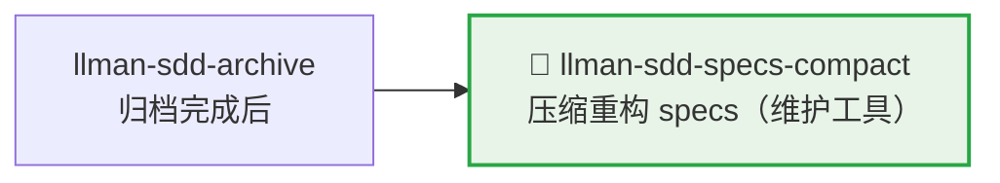

# LLMAN SDD Specs Compact

使用此 skill 在不改变规范行为的前提下压缩 specs。

## Pipeline 位置



> 📎 维护工具，通常在归档积累较多后执行。日常开发 → `llman-sdd-propose` / `llman-sdd-apply`。

## Context
- specs 会随着变更积累而膨胀，并出现重复 requirement/scenario。
- 压缩必须保持可验证、可回归。
- 当 archive 历史过大时，会干扰压缩评审与定位。

## Goal
- 识别并合并冗余 requirement/scenario。
- 形成更紧凑且可维护的规范结构。

## Constraints
- 未经明确替代，不得删除规范性行为。
- 尽量保持 requirement 标题稳定。
- 每个保留 requirement 至少保留一个有效 scenario。

## Workflow
1. 盘点当前 specs（`llman sdd list --specs`）。
2. 如果已归档历史较大，先执行 archive freeze：
   - 预览：`llman sdd archive freeze --dry-run`
   - 执行：`llman sdd archive freeze --before <YYYY-MM-DD> --keep-recent <N>`
3. 识别跨 capability 的重叠项。
4. 产出压缩计划（canonical requirements + keep/merge/remove 决策 + 迁移说明）。
5. 执行并验证（`llman sdd validate --specs --strict --no-interactive`）。

## Decision Policy
- 两条 requirement 语义等价时优先合并。
- 仅在引用关系清晰时提取共享规范文本。
- archive 目录噪声较大时，优先建议先 freeze 再压缩。
- 若压缩会改变外部行为，必须先暂停并询问用户。

## Output Contract
- 输出按 capability 分组的压缩方案。
- 包含：keep/merge/remove 决策及理由。
- 包含验证命令与预期结果。

> 💡 维护完成后，新需求走正常 pipeline：`llman-sdd-propose` → `llman-sdd-apply` → `llman-sdd-verify` → `llman-sdd-archive`。

行动前先阅读 `llmanspec/config.yaml`，并遵循其中的 `context` 与 `rules`（若有）。

常用命令：
- `llman sdd context --task "<描述>" --paths "<文件>"`（找相关 specs）。使用 pageindex agentic tree 后端（需 `LLMAN_SDD_INDEX_CHAT_MODEL`）。可用 `LLMAN_SDD_INDEX_BACKEND` 预设。
- `llman sdd list`（列出变更）
- `llman sdd list --specs`（列出 specs 及 purpose/scope 元数据）
- `llman sdd show <id>`（展示 change/spec）
- `llman sdd validate <id>`（校验 change 或 spec）
- `llman sdd validate --all`（批量校验）
- `llman sdd index rebuild`（重建 pageindex 树索引——不需要模型）
- `llman sdd index check`（检查索引新鲜度）
- `llman sdd change new <id>`（创建草稿 `changes/<id>/proposal.md`）
- `llman sdd change attach <id> [--force]`（BDD-on：绑定 feature 分支 + base SHA）
- `llman sdd change checkpoint <id> [--no-check]`（BDD-on：干净工作区 + 归档前门禁）
- `llman sdd change diff <id> [--export-patch <path>]`（BDD-on：只读 `base...HEAD` 审查/导出）
- `llman sdd change delta …`（仅 BDD-off：TOON delta 作者工具；BDD-on 会拒绝）
- `llman sdd change archive <id>`（封存变更；BDD-on：checkpoint 后仅文档；BDD-off：合并 TOON delta）
- `llman sdd archive freeze [--before YYYY-MM-DD] [--keep-recent N] [--dry-run]`（冻结已归档目录）
- `llman sdd archive thaw [--change <id> ...] [--dest <path>]`（从冷备份恢复）
- `llman sdd graph [CHANGE] [--format mermaid] [--scope active|archived|all] [--depth N]`（生成变更依赖图）
- `llman sdd project migrate [--kind format|partitioned|legacy-bdd|auto]`（一次性迁移）


常见校验修复（TOON 独立文件 spec）：

1) 缺少校验作用域（`Spec valid_scope must not be empty`）：
Main spec 必须在 `.toon` 文档内携带非空的 `valid_scope`。
`llmanspec/specs/<feature-id>/spec.toon`：
```toon
kind: llman.sdd.spec
name: sample
purpose: "One-line overview."
valid_scope[1]: src
requirements[1]{req_id,title,statement}:
  r1,Title,System MUST do something.
scenarios[1]{req_id,id,given,when,then}:
  r1,happy,"",a trigger happens,the outcome is observed
```

2) Change 缺少 delta ops：至少补一个 op + scenario（`llmanspec/changes/<change-id>/specs/<feature-id>/spec.toon`）：
```toon
kind: llman.sdd.delta
ops[1]{op,req_id,title,statement,from,to,name}:
  add_requirement,r1,Title,System MUST do something.,null,null,null
op_scenarios[1]{req_id,id,given,when,then}:
  r1,happy,"",a trigger happens,the outcome is observed
```

3) 表格化行引号错误（"Expected N tabular row values, but got M"）：
值包含**空格**、逗号、冒号或方括号时，必须用双引号包裹。
```toon
# 错误：未加引号的空格值会被拆成多个值
r1,happy,"",a trigger happens,the outcome is observed

# 正确：多词值加引号
r1,happy,"","a trigger happens","the outcome is observed"
```

4) BDD-on 护栏（Git-native Partitioned SSOT）：
`config.yaml` 有 `bdd:` 时：`spec.toon`=约束/不可执行场景；`*.feature`=可执行 GWT（`@req`）。在非默认分支编辑 live 文件 → `change attach` / `checkpoint` → docs-only `change archive` → Git merge。不要找 solidify，也不要新建 `*.feature.delta.toon`（若已存在则是迁移阻断，跑 `project migrate --kind partitioned`）。空 requirements 且无 `.feature` = ERROR。

备注：
- 每个 spec 是一个独立的 `.toon` 文件；没有 Markdown 外壳，也没有 ```toon fence。
- `null` 表示可选字段缺失。
- 从旧版 `.md`+fence 迁移请使用 `llman sdd migrate`。


## Context
- 执行前先确认当前 change/spec 状态。
- 优先使用 `llman sdd context --task --paths` 获取相关 specs，而非全量读取或猜测。

## Goal
- 明确本次命令/skill 要达成的可验证结果。

## Constraints
- 变更保持最小化且范围明确。
- 标识符或意图不明确时禁止猜测。
- 在读取 spec 全文前，先使用 `llman sdd context --task --paths` 获取相关 specs。
- 判断变更规模后选择路径：行为合约变更走完整 SDD 流程，实现变更走快速路径。

## Workflow
- 以 `llman sdd` 命令结果为事实来源。
- 涉及文件/规范变更时执行校验。
- 首选 `llman sdd context` 获取相关 specs，而非全量读取或猜测。
- 当 context 不可用时，按错误提示处理（重建 index 或降级到 `list --specs --json`）。

## Decision Policy
- 高影响歧义必须先澄清。
- 已知校验错误下禁止强行继续。

## Output Contract
- 汇总已执行动作。
- 给出结果路径与校验状态。

## Ethics Governance
- `ethics.risk_level`：按 `low|medium|high|critical` 标注风险等级。
- `ethics.prohibited_actions`：列出绝对禁止执行的动作。
- `ethics.required_evidence`：列出高影响输出前必须具备的证据。
- `ethics.refusal_contract`：定义何时拒答以及安全替代响应方式。
- `ethics.escalation_policy`：定义何时必须升级为用户确认/人工复核。
