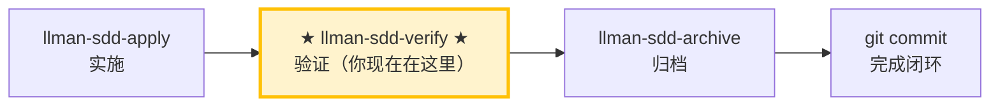

# LLMAN SDD Verify

使用此 skill 验证实现是否与该 change 的 artifacts 一致。

## Pipeline 位置



> 📍 你现在在验证阶段 → 通过后下一步 `llman-sdd-archive`（归档）；失败则回到 `llman-sdd-apply`（修复）

## 硬约束

- **必须先通过 apply 阶段全绿**：未完成实现的 change 跳过验证。
- **CRITICAL 必须修复**：标记为 CRITICAL 的问题归档前必须修复。
- **不要问「要不要继续」**：跑完整个验证流程，输出完整报告。

## 步骤
1. 确定 change id（不明确时让用户从 `llman sdd list --json` 选择）。
2. 检查阶段守卫（权威）：
   ```bash
   stage=$(llman sdd show <id> --json --type change | jq -r .stage)
   ```
   （若无 `jq`，可用任意工具从 JSON 中解析 `stage` 值。）
   - 若 `stage` 不为 `full`，变更尚未实现、无可验证内容 → 必须停止并给出守卫提示：
     - `draft`："变更 <id> 是 draft 提案（仅 proposal.md），尚无可验证的实现。请先用 llman-sdd-propose 生成完整工件，再用 llman-sdd-apply <id> 实现。"
     - 其他非 full 阶段（`specified`/`designed`）："变更 <id> 处于 <stage> 阶段，尚未准备好被验证。请先用 llman-sdd-apply 实现。"
3. 先跑一个快速校验门禁：
   - `llman sdd validate <id> --strict --no-interactive`
4. 阅读：
   - `llmanspec/changes/<id>/specs/` 下的 delta specs
   - `proposal.md` 与 `design.md`（如存在）
   - `tasks.md`（理解实现范围）
5. 对比 artifacts 与代码：
   - 标出不一致（缺失行为、错误行为、缺测试/文档）
   - 给出最小修复建议或建议更新 artifacts
6. **BDD-on 验证（Git-native Partitioned SSOT）**——仅当 `config.yaml` 含 `bdd:` 段时：
   - 确认 change 已 attach，且当前在对应 feature 分支上。
   - `llman sdd validate --specs`：Gherkin + `@req`/双写门禁；默认跑 `bdd.run_command`（可用 `--no-check` 跳过）。
   - 可选只读审查：`llman sdd change diff <id>`（或 `--export-patch <path>`）。diff 仅作审查/导出——绝不当作 apply 步骤。
   - 归档前：工作区干净后运行 `llman sdd change checkpoint <id>`。
   - 检查：可执行 GWT 只在 live `.feature`；`morphology.dualWriteCount` 应为 0；若已有活跃 `*.feature.delta.toon` 则先迁移（不要自创 solidify/找补步骤）。

7. 输出简短报告：
   - **CRITICAL**（归档前必须修复）
   - **WARNING**（建议修复）
   - **SUGGESTION**（可选优化）
8. 若存在 CRITICAL，建议用 `llman-sdd-apply` 修复；若通过（BDD-on：且已 checkpoint）则建议归档：`llman sdd change archive <id>`。

> 💡 验证通过 → 下一步 `llman-sdd-archive`（归档）；有 CRITICAL → 回到 `llman-sdd-apply`（修复）

行动前先阅读 `llmanspec/config.yaml`，并遵循其中的 `context` 与 `rules`（若有）。

常用命令：
- `llman sdd context --task "<描述>" --paths "<文件>"`（找相关 specs）。使用 pageindex agentic tree 后端（需 `LLMAN_SDD_INDEX_CHAT_MODEL`）。可用 `LLMAN_SDD_INDEX_BACKEND` 预设。
- `llman sdd list`（列出变更）
- `llman sdd list --specs`（列出 specs 及 purpose/scope 元数据）
- `llman sdd show <id>`（展示 change/spec）
- `llman sdd validate <id>`（校验 change 或 spec）
- `llman sdd validate --all`（批量校验）
- `llman sdd index rebuild`（重建 pageindex 树索引——不需要模型）
- `llman sdd index check`（检查索引新鲜度）
- `llman sdd change new <id>`（创建草稿 `changes/<id>/proposal.md`）
- `llman sdd change attach <id> [--force]`（BDD-on：绑定 feature 分支 + base SHA）
- `llman sdd change checkpoint <id> [--no-check]`（BDD-on：干净工作区 + 归档前门禁）
- `llman sdd change diff <id> [--export-patch <path>]`（BDD-on：只读 `base...HEAD` 审查/导出）
- `llman sdd change delta …`（仅 BDD-off：TOON delta 作者工具；BDD-on 会拒绝）
- `llman sdd change archive <id>`（封存变更；BDD-on：checkpoint 后仅文档；BDD-off：合并 TOON delta）
- `llman sdd archive freeze [--before YYYY-MM-DD] [--keep-recent N] [--dry-run]`（冻结已归档目录）
- `llman sdd archive thaw [--change <id> ...] [--dest <path>]`（从冷备份恢复）
- `llman sdd graph [CHANGE] [--format mermaid] [--scope active|archived|all] [--depth N]`（生成变更依赖图）
- `llman sdd project migrate [--kind format|partitioned|legacy-bdd|auto]`（一次性迁移）


## Context
- 执行前先确认当前 change/spec 状态。
- 优先使用 `llman sdd context --task --paths` 获取相关 specs，而非全量读取或猜测。

## Goal
- 明确本次命令/skill 要达成的可验证结果。

## Constraints
- 变更保持最小化且范围明确。
- 标识符或意图不明确时禁止猜测。
- 在读取 spec 全文前，先使用 `llman sdd context --task --paths` 获取相关 specs。
- 判断变更规模后选择路径：行为合约变更走完整 SDD 流程，实现变更走快速路径。

## Workflow
- 以 `llman sdd` 命令结果为事实来源。
- 涉及文件/规范变更时执行校验。
- 首选 `llman sdd context` 获取相关 specs，而非全量读取或猜测。
- 当 context 不可用时，按错误提示处理（重建 index 或降级到 `list --specs --json`）。

## Decision Policy
- 高影响歧义必须先澄清。
- 已知校验错误下禁止强行继续。

## Output Contract
- 汇总已执行动作。
- 给出结果路径与校验状态。

## Ethics Governance
- `ethics.risk_level`：按 `low|medium|high|critical` 标注风险等级。
- `ethics.prohibited_actions`：列出绝对禁止执行的动作。
- `ethics.required_evidence`：列出高影响输出前必须具备的证据。
- `ethics.refusal_contract`：定义何时拒答以及安全替代响应方式。
- `ethics.escalation_policy`：定义何时必须升级为用户确认/人工复核。
