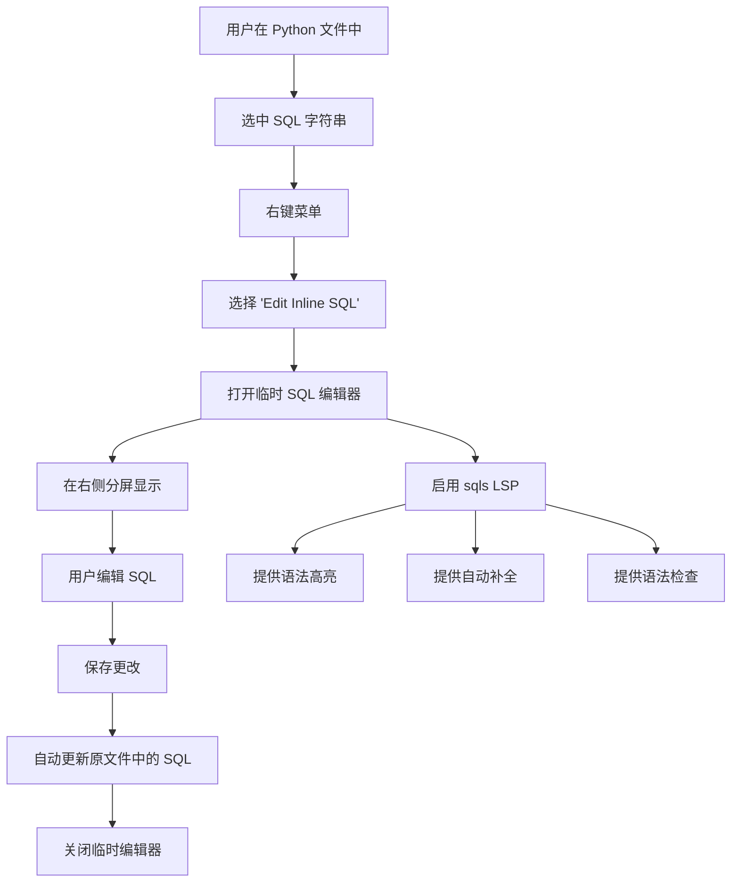
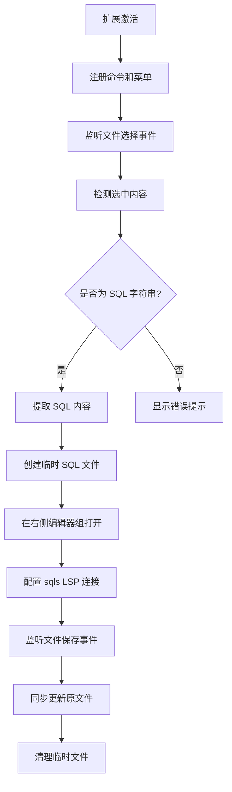
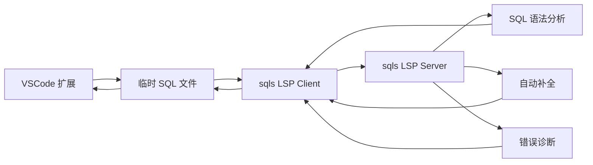
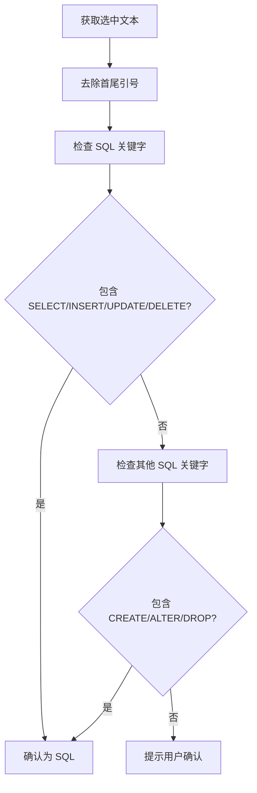
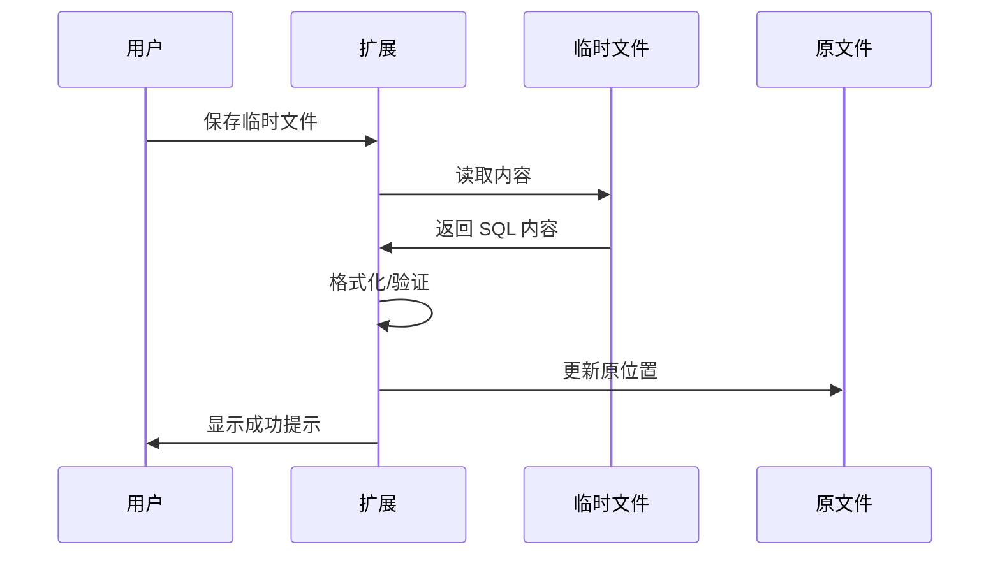
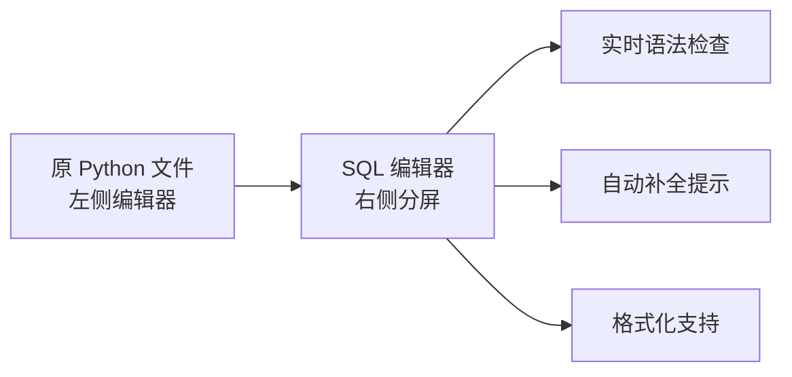
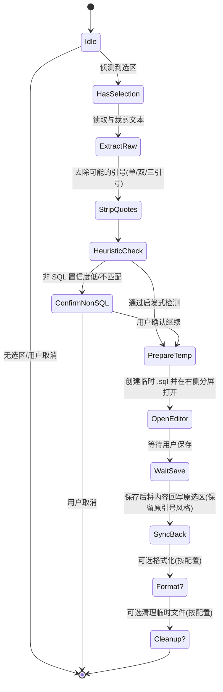

# SQLSugar MVP 需求文档

请分析当前项目所使用的工具链, 版本等信息, 仿照已有的风格进行开发, 如果有任何疑问, 随时调用feedback工具询问意见

## 需求概述

实现一个 VSCode 扩展，允许用户在 Python 文件中对内联的 SQL 字符串进行优化编辑。通过集成 sqls 语言服务器，提供 SQL 语法高亮、自动补全和语法检查功能。

## 核心功能需求

### 1. 内联 SQL 编辑器
用户在 Python 文件中选中 SQL 字符串片段后，可以在临时的 SQL 编辑器窗口中进行编辑，享受完整的 SQL 语言服务支持。

### 2. SQL 文件增强支持
为 `.sql` 文件提供基于 sqls LSP 的完整语言服务支持。

## 技术规格

### 当前工具链
- **VSCode 引擎**: ^1.102.0
- **TypeScript**: ^5.9.2
- **构建工具**: esbuild ^0.25.8
- **包管理器**: pnpm
- **代码规范**: ESLint ^9.32.0 + TypeScript ESLint
- **测试框架**: @vscode/test-cli, Mocha

### 依赖的外部工具
- **sqls LSP Server**: https://github.com/lighttiger2505/sqls
- **参考实现**: https://github.com/lighttiger2505/vscode-sqls

## MVP 功能流程

### 用户交互流程



### 技术实现流程



### LSP 集成架构



## 详细技术要求

### 1. 命令和菜单注册

#### 命令定义
```typescript
"contributes": {
  "commands": [
    {
      "command": "sqlsugar.editInlineSQL",
      "title": "Edit Inline SQL"
    }
  ],
  "menus": {
    "editor/context": [
      {
        "command": "sqlsugar.editInlineSQL",
        "when": "editorHasSelection",
        "group": "1_modification"
      }
    ]
  }
}
```

### 2. SQL 字符串检测逻辑

#### 检测规则
- 支持单引号、双引号、三引号字符串
- 支持 f-string 中的 SQL
- 支持多行字符串
- 基于常见 SQL 关键字进行启发式检测

#### 检测模式


### 3. 临时文件管理

#### 文件命名规则
- 格式: `temp_sql_${timestamp}_${hash}.sql`
- 位置: 工作区 `.vscode/sqlsugar/temp/`
- 自动清理: 扩展关闭时删除

#### 文件同步机制


### 4. LSP 客户端配置

#### sqls LSP 启动参数
```json
{
  "command": "sqls",
  "args": ["serve"],
  "options": {
    "env": {
      "SQLS_CONFIG": ".sqls/config.yml"
    }
  }
}
```

#### 语言服务器特性
- **语法高亮**: 完整 SQL 语法支持
- **自动补全**: 表名、列名、函数补全
- **错误诊断**: 语法错误检测
- **格式化**: SQL 代码格式化
- **悬停信息**: 表结构、函数说明

### 5. 用户体验设计

#### 编辑器布局


#### 错误处理策略
- **选择内容非 SQL**: 提示用户选择有效 SQL 字符串
- **sqls 未安装**: 提供安装指导链接
- **LSP 连接失败**: 降级到基础编辑模式
- **同步失败**: 保留临时文件，提示手动复制

### 6. 配置选项

#### 扩展设置
```json
{
  "sqlsugar.sqlsPath": {
    "type": "string",
    "default": "sqls",
    "description": "Path to sqls executable"
  },
  "sqlsugar.autoFormat": {
    "type": "boolean",
    "default": true,
    "description": "Auto format SQL on save"
  },
  "sqlsugar.tempFileCleanup": {
    "type": "boolean",
    "default": true,
    "description": "Auto cleanup temporary files"
  }
}
```

## 参考实现

- **sqls LSP server**: https://github.com/lighttiger2505/sqls
- **vscode-sqls 插件**: https://github.com/lighttiger2505/vscode-sqls
- **sqlfluff**: https://docs.sqlfluff.com
  - support sqlalchemy like placeholder: https://docs.sqlfluff.com/en/3.3.1/configuration/templating/placeholder.html

## 实现优先级

### Phase 1 (MVP Core)
1. 基础命令注册和菜单集成
2. SQL 字符串检测逻辑
3. 临时文件创建和管理
4. 基础的内容同步机制

### Phase 2 (LSP Integration)
1. sqls LSP 客户端集成
2. 语法高亮和错误诊断
3. 自动补全功能
4. 格式化支持

### Phase 3 (Enhanced UX)
1. 配置选项支持
2. 错误处理优化
3. 性能优化
4. 用户反馈收集

## 成功标准

1. ✅ 用户可以通过右键菜单打开 SQL 编辑器
2. ✅ SQL 编辑器提供语法高亮和补全
3. ✅ 保存后能正确同步回原文件
4. ✅ 支持多种 Python SQL 字符串格式
5. ✅ 临时文件能正确清理
6. ✅ 错误情况有友好的用户提示

## 入口与触发方式

- 右键菜单：在编辑器选区上右键，选择 Edit Inline SQL（默认入口，优先支持）
- 命令面板：通过 Ctrl/Cmd+Shift+P 打开命令面板，搜索并执行 Edit Inline SQL
- 键位绑定：不提供默认键位绑定，用户可在 VSCode 键位设置中为命令 sqlsugar.editInlineSQL 自行绑定快捷键
  - 建议示例：Alt+S（仅供参考，不作为默认方案）


## 选区检测状态机



## 边界条件与处理

- Python 字符串形式支持：
  - 单引号 '...'
  - 双引号 "..."
  - 三引号 '''...''' / """..."""
  - f-string 前缀：保留占位符与花括号，不进行插值计算
- 多行字符串：支持，临时文件会完整展开为 .sql
- 非 SQL 片段：提示风险并允许用户继续或取消
- 文件类型：主要面向 Python；.sql 文件可直接使用现有 LSP 能力，无需临时拆分
- 文本编码：统一按 UTF-8 读写
- 回写策略：严格保留原引号边界与字符串前后空白字符
- 并发编辑：同一原文件多次打开临时编辑器时，根据时间戳与哈希区分；以最后一次保存为准

## 安全与隐私

- 不记录/打印 SQL 内容到日志
- 不上传任何内容到外部服务
- sqls LSP 本地运行，需用户已安装；若未安装则降级为无 LSP 的基础编辑
- 配置项中不包含敏感信息；遵循 VSCode 设置存储规范