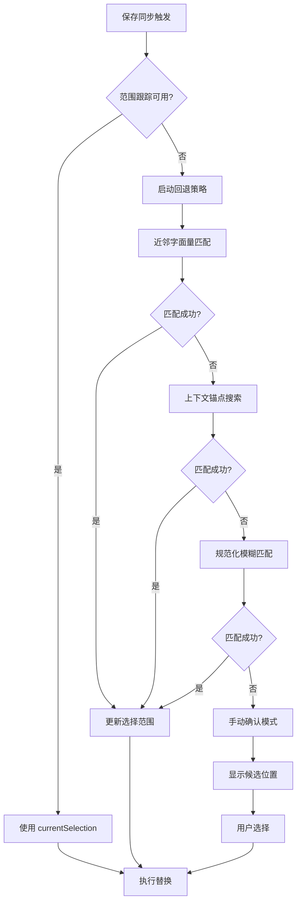

# 基于内容匹配的回退策略优化方案

## 背景

### 当前实现问题
在多次保存同步的场景中，当前的"范围跟踪"策略（通过维护 `currentSelection` 状态）已经能很好地处理绝大多数用例。但在以下特殊情况下可能出现同步定位失败：

1. **用户在原文件中重新排列代码**：在临时编辑器保存间隙，用户可能在原 Python 文件中移动、插入或删除 SQL 块附近的代码
2. **编辑器环境异常**：VSCode 意外重启、扩展被重新加载、或者编辑器组被重新排列
3. **状态丢失场景**：由于某些未预期的事件导致 `currentSelection` 状态被重置或损坏
4. **并发编辑冲突**：多个开发者同时编辑同一文件，或者使用其他工具修改了原文件

### 需求分析
需要一个鲁棒的回退策略，在"范围跟踪"失效时能够自动恢复同步能力，确保临时 SQL 编辑器的更改始终能正确写回原文件。

## 解决方案

### 核心思路
实现多层级的定位策略，按照精度和成本递进：



### 策略层级详细设计

#### 第一层：近邻字面量匹配
在原始选择位置附近搜索相同的 SQL 字符串字面量。

```typescript
interface NearbyLiteralSearch {
  // 在原始位置前后 N 行范围内搜索
  searchRadius: number; // 默认 20 行
  
  // 匹配策略
  strategy: {
    // 精确匹配引号内的 SQL 内容
    exactMatch: boolean;
    // 考虑空白字符差异
    ignoreWhitespace: boolean;
    // 匹配字符串字面量边界（引号位置）
    respectQuoteBoundaries: boolean;
  };
}
```

**实现逻辑**：
1. 从 `originalSelection.start` 向前后各扩展 N 行
2. 使用正则表达式匹配所有字符串字面量 `["']([^"']*(?:["'][^"']*)*["'])`
3. 对每个候选字面量，提取内部 SQL 内容并与当前 `currentRaw` 比较
4. 选择最接近原始位置的匹配项

#### 第二层：上下文锚点搜索
利用初次选择时记录的上下文信息进行定位。

```typescript
interface ContextAnchor {
  // 在首次打开临时编辑器时记录
  beforeContext: string; // SQL 块前 2-3 行代码
  afterContext: string;  // SQL 块后 2-3 行代码
  
  // 匹配时的容忍度
  similarity: {
    threshold: number; // 相似度阈值 0.7
    algorithm: 'levenshtein' | 'jaro-winkler';
  };
}
```

**实现逻辑**：
1. 在文档中搜索与 `beforeContext` 最相似的代码段
2. 在这些段落的后续行中寻找字符串字面量
3. 使用字符串相似度算法评估候选位置
4. 选择综合评分最高的位置

#### 第三层：规范化模糊匹配
对 SQL 内容进行标准化处理后进行全文档搜索。

```typescript
interface NormalizedSearch {
  normalization: {
    // 统一空白字符
    collapseWhitespace: boolean;
    // 转换为小写
    toLowerCase: boolean;
    // 移除注释
    removeComments: boolean;
    // 标准化占位符（:param -> __:param）
    normalizePlaceholders: boolean;
  };
  
  // 最大搜索范围（避免性能问题）
  maxSearchLines: number; // 默认 500 行
}
```

**实现逻辑**：
1. 对当前 `currentRaw` 中的 SQL 进行规范化处理
2. 逐行扫描原文档，对每个字符串字面量进行相同的规范化
3. 计算规范化后的相似度评分
4. 返回评分超过阈值的最佳匹配位置

#### 第四层：手动确认模式
当自动策略都失败时，提供交互式选择界面。

```typescript
interface ManualConfirmation {
  // 展示候选位置列表
  candidates: Array<{
    range: vscode.Range;
    content: string; // 显示的代码片段
    confidence: number; // 置信度评分
    reason: string; // 匹配原因说明
  }>;
  
  // 用户交互选项
  actions: {
    selectPosition: (candidate: Candidate) => void;
    skipSync: () => void; // 跳过本次同步
    editManually: () => void; // 显示临时文件供手动复制
  };
}
```

### 状态管理增强

#### 上下文信息记录
在首次打开临时编辑器时记录更多上下文：

```typescript
interface SyncContext {
  // 基础信息（已有）
  originalRaw: string;
  originalSelection: vscode.Selection;
  
  // 新增：上下文锚点
  beforeLines: string[]; // 前 3 行
  afterLines: string[];  // 后 3 行
  
  // 新增：文档特征
  documentHash: string; // 文档内容的哈希值
  lastSyncTime: number; // 上次同步时间戳
  
  // 新增：回退策略配置
  fallbackConfig: FallbackConfig;
}
```

#### 智能状态验证
在每次保存前验证当前状态是否仍然有效：

```typescript
interface StateValidation {
  // 检查文档是否发生重大变化
  documentChanged: () => boolean;
  
  // 检查当前选择范围是否仍然指向相同内容
  selectionValid: () => boolean;
  
  // 决定是否需要启动回退策略
  needsFallback: () => boolean;
}
```

## 技术实现

### 新增辅助函数

```typescript
// 1. 近邻搜索
function findNearbyStringLiteral(
  document: vscode.TextDocument,
  center: vscode.Position,
  target: string,
  radius: number = 20
): vscode.Range | null

// 2. 上下文匹配
function findByContextAnchor(
  document: vscode.TextDocument,
  anchor: ContextAnchor,
  target: string
): vscode.Range | null

// 3. 规范化搜索
function findByNormalizedContent(
  document: vscode.TextDocument,
  normalizedTarget: string,
  config: NormalizedSearch
): vscode.Range[]

// 4. 相似度计算
function calculateSimilarity(
  a: string,
  b: string,
  algorithm: 'levenshtein' | 'jaro-winkler'
): number

// 5. 手动确认界面
function showPositionSelector(
  candidates: Candidate[]
): Promise<vscode.Range | null>
```

### 主逻辑集成

修改现有的保存监听器：

```typescript
const saveDisposable = vscode.workspace.onDidSaveTextDocument(async (doc) => {
  if (doc.uri.fsPath !== tempFilePath) { return; }
  
  // ... 现有的转换逻辑 ...
  
  // 增强的位置选择逻辑
  let targetSelection = currentSelection;
  
  // 验证当前状态
  if (!isSelectionValid(editor, currentSelection, currentRaw)) {
    console.log('Current selection invalid, starting fallback strategy');
    
    // 启动回退策略
    targetSelection = await findFallbackPosition(
      editor.document,
      syncContext,
      wrappedSQL
    );
    
    if (!targetSelection) {
      // 所有自动策略失败，进入手动模式
      const candidates = await gatherPositionCandidates(
        editor.document,
        syncContext,
        wrappedSQL
      );
      
      targetSelection = await showPositionSelector(candidates);
      
      if (!targetSelection) {
        vscode.window.showWarningMessage(
          'Sync cancelled. Temp file preserved for manual copy.'
        );
        return;
      }
    }
    
    // 更新状态
    currentSelection = targetSelection;
    console.log('Fallback successful, new selection:', targetSelection);
  }
  
  // 执行替换
  await replaceSelection(editor, targetSelection, wrappedSQL);
  
  // ... 现有的状态更新逻辑 ...
});
```

## 配置选项

在扩展设置中添加回退策略配置：

```json
{
  "sqlsugar.fallback.enabled": {
    "type": "boolean",
    "default": true,
    "description": "Enable content-based fallback strategy when position tracking fails"
  },
  "sqlsugar.fallback.searchRadius": {
    "type": "number",
    "default": 20,
    "description": "Number of lines to search around original position"
  },
  "sqlsugar.fallback.similarityThreshold": {
    "type": "number",
    "default": 0.7,
    "minimum": 0.0,
    "maximum": 1.0,
    "description": "Minimum similarity score for content matching"
  },
  "sqlsugar.fallback.manualConfirmation": {
    "type": "boolean",
    "default": true,
    "description": "Show manual position selector when automatic fallback fails"
  }
}
```

## 性能考虑

### 优化策略
1. **惰性计算**：只在需要时才执行回退策略
2. **缓存机制**：缓存规范化结果和相似度计算
3. **范围限制**：限制搜索范围避免大文件性能问题
4. **早期退出**：一旦找到高置信度匹配就停止搜索

### 性能指标
- 近邻搜索：< 10ms（20行范围）
- 上下文匹配：< 50ms（500行文档）
- 规范化搜索：< 100ms（1000行文档）
- 手动确认界面：< 2s（用户交互时间）

## 测试用例

### 新增测试场景

```typescript
describe('Fallback Strategy Tests', () => {
  test('Nearby literal search finds moved SQL block', async () => {
    // 模拟用户在原文件中移动代码的场景
  });
  
  test('Context anchor recovers from minor code changes', async () => {
    // 模拟原文件有小幅修改但SQL块仍可识别
  });
  
  test('Normalized search handles whitespace differences', async () => {
    // 模拟SQL内容相同但格式不同的情况
  });
  
  test('Manual confirmation shows valid candidates', async () => {
    // 模拟所有自动策略失败时的用户交互
  });
  
  test('Performance within acceptable limits', async () => {
    // 验证各层策略的性能表现
  });
});
```

## 实现优先级

### Phase 1: 基础回退机制
1. 实现状态验证逻辑
2. 添加近邻字面量搜索
3. 集成到现有保存监听器

### Phase 2: 高级匹配策略  
1. 实现上下文锚点搜索
2. 添加规范化模糊匹配
3. 性能优化和缓存

### Phase 3: 用户交互增强
1. 实现手动确认界面
2. 添加配置选项支持
3. 完整测试覆盖

## 成功标准

1. **鲁棒性**：在 95% 的异常场景下能自动恢复同步能力
2. **性能**：回退策略执行时间 < 100ms（中等大小文件）
3. **用户体验**：自动策略失败时提供清晰的手动选择界面
4. **向后兼容**：不影响现有的范围跟踪机制
5. **测试覆盖**：所有回退路径都有对应的测试用例

## 风险评估

### 潜在风险
1. **误匹配风险**：自动策略可能选择错误的位置
2. **性能开销**：复杂匹配算法可能影响响应速度
3. **用户困惑**：手动确认界面可能让用户感到复杂

### 缓解措施
1. **置信度评分**：为每个匹配结果提供可信度指标
2. **保守策略**：宁可进入手动模式也不进行低置信度的自动替换
3. **渐进式提醒**：通过适当的 UI 提示引导用户理解回退机制