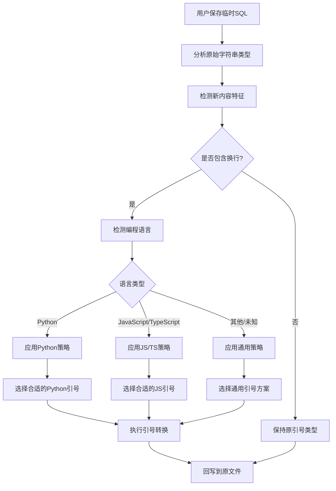

# 多行字符串语言适配策略

## 背景

### 当前问题
在当前的实现中，扩展使用 `stripQuotes` 和 `wrapLike` 函数来处理字符串的引号包裹。当用户编辑单行字符串的 SQL 并将其改为多行时，会出现语法错误：

**原始代码（Python）**：
```python
query = "SELECT * FROM users WHERE id = :user_id"
```

**用户编辑后**：
```sql
SELECT *
FROM users 
WHERE id = :user_id
  AND status = 'active'
```

**回写后的问题代码**：
```python
query = "SELECT *
FROM users 
WHERE id = :user_id
  AND status = 'active'"
```

这样的多行字符串在 Python 中是不合法的，会导致语法错误。

### 需求分析
需要一个智能的引号适配策略，能够：
1. 检测源代码的编程语言
2. 根据语言特性和内容变化自动选择合适的字符串包裹方式
3. 保证回写后的代码在目标语言中语法正确
4. 最小化对用户现有代码风格的影响

## 解决方案

### 核心策略：自适应引号升级



### 语言特定策略

#### Python 语言策略
```typescript
interface PythonQuoteStrategy {
  // 单行 -> 多行转换规则
  singleToMultiLine: {
    // "..." -> """..."""
    doubleQuote: '"""',
    // '...' -> '''...'''  
    singleQuote: "'''",
  };
  
  // 保持现有多行引号不变
  preserveExistingMultiLine: boolean;
  
  // 检测f-string前缀并保留
  preserveFStringPrefix: boolean;
}
```

**转换示例**：
```python
# 单引号 -> 三单引号
query = 'SELECT * FROM users'
# 编辑为多行后
query = '''SELECT * 
FROM users 
WHERE active = true'''

# 双引号 -> 三双引号  
query = "SELECT * FROM users"
# 编辑为多行后
query = """SELECT * 
FROM users 
WHERE active = true"""

# f-string -> f-三引号
query = f"SELECT * FROM {table}"
# 编辑为多行后
query = f"""SELECT * 
FROM {table} 
WHERE active = true"""
```

#### JavaScript/TypeScript 策略
```typescript
interface JSQuoteStrategy {
  // 单行 -> 多行转换规则
  singleToMultiLine: {
    // "..." -> `...`
    doubleQuote: 'backtick',
    // '...' -> `...`
    singleQuote: 'backtick',
  };
  
  // 模板字符串变量处理
  preserveTemplateVariables: boolean;
  
  // 处理已有的反引号字符串
  preserveExistingTemplate: boolean;
}
```

**转换示例**：
```javascript
// 单引号 -> 模板字符串
const query = 'SELECT * FROM users';
// 编辑为多行后
const query = `SELECT * 
FROM users 
WHERE active = true`;

// 双引号 -> 模板字符串
const query = "SELECT * FROM users";
// 编辑为多行后  
const query = `SELECT * 
FROM users 
WHERE active = true`;
```

#### 通用策略
对于其他语言或无法识别的语言：
```typescript
interface GenericQuoteStrategy {
  // 保守策略：尽量保持原有引号类型
  preserveOriginal: boolean;
  
  // 如果必须转换，优先选择
  fallbackQuote: 'double' | 'single';
  
  // 警告用户可能的语法问题
  showLanguageWarning: boolean;
}
```

## 技术实现

### 1. 语言检测增强

```typescript
/**
 * 检测文档的编程语言
 */
function detectLanguage(document: vscode.TextDocument): LanguageType {
  // 优先使用VSCode的语言ID
  const vscodeLanguageId = document.languageId;
  
  // 语言映射表
  const languageMap: Record<string, LanguageType> = {
    'python': 'python',
    'javascript': 'javascript', 
    'typescript': 'typescript',
    'javascriptreact': 'javascript',
    'typescriptreact': 'typescript',
  };
  
  if (languageMap[vscodeLanguageId]) {
    return languageMap[vscodeLanguageId];
  }
  
  // 回退到文件扩展名检测
  const fileName = document.fileName;
  if (fileName.endsWith('.py')) return 'python';
  if (fileName.endsWith('.js') || fileName.endsWith('.jsx')) return 'javascript';
  if (fileName.endsWith('.ts') || fileName.endsWith('.tsx')) return 'typescript';
  
  return 'unknown';
}

type LanguageType = 'python' | 'javascript' | 'typescript' | 'unknown';
```

### 2. 智能引号选择器

```typescript
/**
 * 根据语言和内容特征选择合适的引号类型
 */
function selectQuoteType(
  originalQuoted: string,
  newContent: string,
  language: LanguageType
): QuoteType {
  const hasMultipleLines = newContent.includes('\n');
  const originalQuoteType = detectQuoteType(originalQuoted);
  
  // 单行内容保持原有引号
  if (!hasMultipleLines) {
    return originalQuoteType;
  }
  
  // 多行内容根据语言策略选择
  switch (language) {
    case 'python':
      return selectPythonQuote(originalQuoteType, newContent);
    
    case 'javascript':
    case 'typescript':
      return selectJSQuote(originalQuoteType, newContent);
    
    case 'unknown':
    default:
      return selectGenericQuote(originalQuoteType, newContent);
  }
}

type QuoteType = 'single' | 'double' | 'triple-single' | 'triple-double' | 'backtick';
```

### 3. 语言特定的引号选择逻辑

```typescript
/**
 * Python引号选择策略
 */
function selectPythonQuote(original: QuoteType, content: string): QuoteType {
  const hasSingleQuotes = content.includes("'");
  const hasDoubleQuotes = content.includes('"');
  
  // 根据内容中的引号类型选择不冲突的三引号
  if (original === 'single' || original === 'triple-single') {
    // 如果内容包含三单引号，改用三双引号
    if (content.includes("'''")) {
      return 'triple-double';
    }
    return 'triple-single';
  }
  
  if (original === 'double' || original === 'triple-double') {
    // 如果内容包含三双引号，改用三单引号
    if (content.includes('"""')) {
      return 'triple-single';
    }
    return 'triple-double';
  }
  
  // 默认使用三双引号
  return 'triple-double';
}

/**
 * JavaScript/TypeScript引号选择策略
 */
function selectJSQuote(original: QuoteType, content: string): QuoteType {
  // JavaScript多行字符串统一使用模板字符串
  return 'backtick';
}

/**
 * 通用引号选择策略
 */
function selectGenericQuote(original: QuoteType, content: string): QuoteType {
  // 保守策略：尽量保持原有类型，实在不行用双引号
  if (original === 'triple-single' || original === 'triple-double') {
    return original;
  }
  
  // 单行引号转多行时保持双引号（较通用）
  return 'double';
}
```

### 4. 增强的 wrapLike 函数

```typescript
/**
 * 智能包裹函数，支持语言感知的引号选择
 */
function wrapLikeIntelligent(
  original: string,
  content: string,
  document: vscode.TextDocument
): string {
  const language = detectLanguage(document);
  const selectedQuoteType = selectQuoteType(original, content, language);
  
  // 检测并保留前缀（如Python的f-string）
  const prefix = extractPrefix(original);
  
  return wrapWithQuoteType(content, selectedQuoteType, prefix);
}

/**
 * 提取字符串前缀（如 f, r, u 等）
 */
function extractPrefix(original: string): string {
  const match = original.match(/^([fru]*)/i);
  return match ? match[1] : '';
}

/**
 * 使用指定的引号类型包裹内容
 */
function wrapWithQuoteType(
  content: string,
  quoteType: QuoteType,
  prefix: string = ''
): string {
  switch (quoteType) {
    case 'single':
      return `${prefix}'${content}'`;
    case 'double':
      return `${prefix}"${content}"`;
    case 'triple-single':
      return `${prefix}'''${content}'''`;
    case 'triple-double':
      return `${prefix}"""${content}"""`;
    case 'backtick':
      return `${prefix}\`${content}\``;
    default:
      return `${prefix}"${content}"`;
  }
}
```

## 配置选项

### 扩展设置
```json
{
  "sqlsugar.quoteAdaptation": {
    "type": "object",
    "default": {
      "enabled": true,
      "pythonStrategy": "auto",
      "javascriptStrategy": "template",
      "showLanguageWarnings": true
    },
    "description": "多行字符串引号适配策略"
  }
}
```

### 配置选项说明
```typescript
interface QuoteAdaptationConfig {
  // 是否启用智能引号适配
  enabled: boolean;
  
  // Python策略：auto(自动选择) | preserve(保持原有) | double(强制双引号) | single(强制单引号)
  pythonStrategy: 'auto' | 'preserve' | 'triple-double' | 'triple-single';
  
  // JavaScript策略：template(模板字符串) | preserve(保持原有)
  javascriptStrategy: 'template' | 'preserve';
  
  // 是否显示语言相关警告
  showLanguageWarnings: boolean;
  
  // 未知语言的回退策略
  unknownLanguageFallback: 'double' | 'single' | 'preserve';
}
```

## 用户交互增强

### 冲突检测与警告
当检测到可能的语法冲突时，显示友好的提示：

```typescript
/**
 * 检测并警告潜在的语法问题
 */
async function checkAndWarnQuoteConflicts(
  originalQuoted: string,
  newContent: string,
  selectedQuoteType: QuoteType,
  language: LanguageType
): Promise<boolean> {
  const conflicts = detectQuoteConflicts(newContent, selectedQuoteType);
  
  if (conflicts.length > 0) {
    const message = `检测到引号冲突：${conflicts.join(', ')}。是否继续？`;
    const result = await vscode.window.showWarningMessage(
      message,
      { modal: true },
      '继续',
      '取消'
    );
    return result === '继续';
  }
  
  return true;
}
```

### 预览功能
在回写前显示预览，让用户确认结果：

```typescript
/**
 * 显示引号转换预览
 */
async function showQuoteConversionPreview(
  original: string,
  converted: string,
  language: LanguageType
): Promise<boolean> {
  const panel = vscode.window.createWebviewPanel(
    'quotePreview',
    '引号转换预览',
    vscode.ViewColumn.Beside,
    {}
  );
  
  panel.webview.html = generatePreviewHTML(original, converted, language);
  
  // ... 用户确认逻辑
}
```

## 测试策略

### 单元测试用例
```typescript
describe('Quote Adaptation', () => {
  describe('Python Language', () => {
    test('single quote to triple single quote', () => {
      const original = "'SELECT * FROM users'";
      const multilineContent = "SELECT *\nFROM users\nWHERE active = true";
      const result = wrapLikeIntelligent(original, multilineContent, pythonDoc);
      expect(result).toBe("'''SELECT *\nFROM users\nWHERE active = true'''");
    });
    
    test('double quote to triple double quote', () => {
      const original = '"SELECT * FROM users"';
      const multilineContent = "SELECT *\nFROM users\nWHERE active = true";
      const result = wrapLikeIntelligent(original, multilineContent, pythonDoc);
      expect(result).toBe('"""SELECT *\nFROM users\nWHERE active = true"""');
    });
    
    test('f-string prefix preservation', () => {
      const original = 'f"SELECT * FROM {table}"';
      const multilineContent = "SELECT *\nFROM {table}\nWHERE active = true";
      const result = wrapLikeIntelligent(original, multilineContent, pythonDoc);
      expect(result).toBe('f"""SELECT *\nFROM {table}\nWHERE active = true"""');
    });
  });
  
  describe('JavaScript Language', () => {
    test('single quote to template string', () => {
      const original = "'SELECT * FROM users'";
      const multilineContent = "SELECT *\nFROM users\nWHERE active = true";
      const result = wrapLikeIntelligent(original, multilineContent, jsDoc);
      expect(result).toBe("`SELECT *\nFROM users\nWHERE active = true`");
    });
    
    test('template variable preservation', () => {
      const original = "`SELECT * FROM ${table}`";
      const multilineContent = "SELECT *\nFROM ${table}\nWHERE active = true";
      const result = wrapLikeIntelligent(original, multilineContent, jsDoc);
      expect(result).toBe("`SELECT *\nFROM ${table}\nWHERE active = true`");
    });
  });
  
  describe('Quote Conflict Detection', () => {
    test('detects triple quote conflicts in Python', () => {
      const content = "SELECT * FROM users WHERE description = '''example'''";
      const conflicts = detectQuoteConflicts(content, 'triple-single');
      expect(conflicts).toContain('内容包含三单引号');
    });
    
    test('detects backtick conflicts in JavaScript', () => {
      const content = "SELECT * FROM users WHERE command = `ls -la`";
      const conflicts = detectQuoteConflicts(content, 'backtick');
      expect(conflicts).toContain('内容包含反引号');
    });
  });
});
```

### 集成测试场景
```typescript
describe('End-to-End Quote Adaptation', () => {
  test('Python: single line to multi-line conversion', async () => {
    // 1. 创建包含单行SQL的Python文件
    // 2. 选择SQL字符串并执行编辑命令
    // 3. 在临时编辑器中添加换行
    // 4. 保存并验证回写结果使用了三引号
  });
  
  test('JavaScript: preserves template variables', async () => {
    // 1. 创建包含模板字符串的JavaScript文件
    // 2. 测试多行转换保持${variable}语法
  });
  
  test('Configuration override behavior', async () => {
    // 1. 修改配置为非默认值
    // 2. 验证策略按配置执行
  });
});
```

## 实现优先级

### Phase 1: 核心语言检测与Python支持
1. 实现 `detectLanguage` 函数
2. 实现 Python 的引号适配策略
3. 修改 `wrapLike` 为 `wrapLikeIntelligent`
4. 基础测试用例

### Phase 2: JavaScript/TypeScript支持
1. 实现 JavaScript/TypeScript 的模板字符串转换
2. 添加变量保持逻辑
3. 扩展测试覆盖

### Phase 3: 用户体验增强
1. 添加配置选项支持
2. 实现冲突检测与警告
3. 可选的预览功能
4. 完整的端到端测试

### Phase 4: 高级特性
1. 更多语言支持（如C#、Java等）
2. 智能内容分析（检测SQL中的引号使用）
3. 用户自定义策略配置
4. 性能优化

## 成功标准

1. **正确性**：转换后的代码在目标语言中语法正确
2. **智能性**：自动检测语言并应用合适策略，无需用户干预
3. **灵活性**：提供配置选项满足不同团队的代码风格
4. **兼容性**：不破坏现有的单行字符串编辑功能
5. **用户体验**：清晰的错误提示和可选的预览功能

## 风险评估

### 潜在风险
1. **语言检测失误**：错误的语言检测可能导致不合适的引号选择
2. **内容冲突**：SQL内容本身包含目标引号类型，造成语法错误
3. **配置复杂性**：过多的配置选项可能让用户困惑
4. **性能影响**：复杂的内容分析可能影响编辑器响应速度

### 风险缓解
1. **多层检测**：结合 VSCode 语言ID、文件扩展名、启发式检测
2. **冲突检测**：主动扫描内容中的引号使用，提前警告用户
3. **合理默认值**：提供智能的默认配置，减少用户配置负担
4. **性能优化**：缓存检测结果，使用高效的字符串算法

### 向后兼容
- 新功能默认启用，但提供配置选项可以禁用
- 保持现有的 `stripQuotes` 和 `wrapLike` 函数作为回退
- 确保现有测试用例继续通过