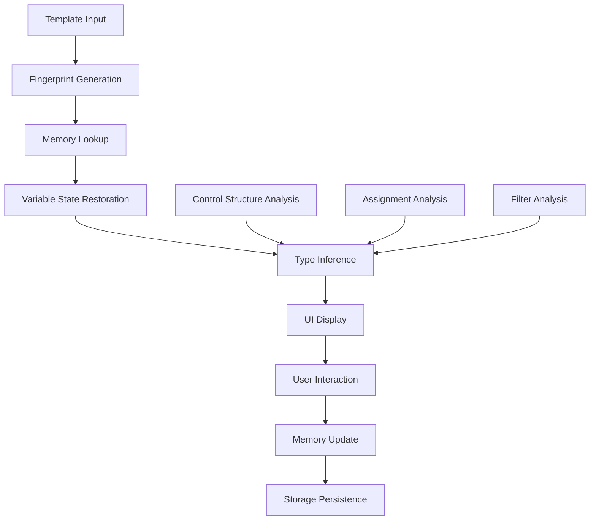

# Data Model: Jinja2 V2 Editor UX Optimization

## Core Entities

### TemplateFingerprint

```typescript
interface TemplateFingerprint {
  // Primary identification
  structureHash: string;        // SHA-256 of template structure
  variableNames: string[];      // Sorted list of variable names
  variableCount: number;        // Number of variables

  // Secondary identification
  contentHash: string;          // Full content hash
  templateLength: number;       // Template character count

  // Metadata
  created: number;              // Creation timestamp
  lastSeen: number;             // Last access timestamp
  filePath?: string;            // Optional source file path
}
```

### VariableMemory

```typescript
interface VariableMemory {
  variableName: string;
  value: Jinja2VariableValue;
  type: Jinja2VariableType;
  timestamp: number;            // When value was remembered
  confidence: number;           // 0-1 confidence score
  source: 'user' | 'inferred' | 'default' | 'suggestion';
  templateFingerprint: string;  // Associated template fingerprint
  usageCount: number;           // How many times this value has been used
  lastUsed: number;             // Last usage timestamp
}
```

### TypeInferenceResult

```typescript
interface TypeInferenceResult {
  type: Jinja2VariableType;
  confidence: number;           // 0-1 confidence score
  reasons: string[];            // Explanation of inference
  alternatives?: Array<{
    type: Jinja2VariableType;
    confidence: number;
    reason: string;
  }>;
  source: 'naming' | 'context' | 'assignment' | 'filter' | 'manual';
}

interface VariableContext {
  surroundingText: { before: string; after: string };
  semanticContext: string;
  relatedVariables: string[];

  // Enhanced inference context
  controlStructures: ControlStructure[];
  assignments: Assignment[];
  filters: FilterUsage[];
  position: { line: number; column: number };
}

interface ControlStructure {
  type: 'if' | 'for' | 'set' | 'macro' | 'block';
  condition?: string;           // For if statements
  iterator?: string;            // For for loops
  collection?: string;          // For for loops
  assignment?: Assignment;      // For set statements
  position: { line: number; column: number };
}

interface Assignment {
  variableName: string;
  expression: string;
  inferredType?: Jinja2VariableType;
  confidence: number;
  position: { line: number; column: number };
}

interface FilterUsage {
  variableName: string;
  filterName: string;
  parameters: string[];
  inferredType?: Jinja2VariableType;
  confidence: number;
}
```

### Enhanced Variable State

```typescript
interface EnhancedVariableState {
  current: Jinja2VariableValue;
  type: Jinja2VariableType;
  history: VariableHistoryEntry[];
  isValid: boolean;
  validationError?: string | null;
  lastModified: number;

  // Memory persistence fields
  memoryId?: string;                    // Unique identifier for memory
  isRemembered: boolean;                // Whether value is persisted
  rememberSource?: 'user' | 'inferred';
  lastRemembered?: number;
  memoryConfidence: number;             // Confidence in remembered value

  // Type inference fields
  typeInference?: TypeInferenceResult;
  inferenceOverride?: {
    originalType: Jinja2VariableType;
    overriddenType: Jinja2VariableType;
    reason: string;
    timestamp: number;
  };
}
```

### Storage Schema

```typescript
interface VariableMemoryStorage {
  version: string;
  lastMigrated: number;

  // Template fingerprints and associated data
  templates: {
    [fingerprint: string]: {
      fingerprint: TemplateFingerprint;
      variables: {
        [name: string]: VariableMemory[];
      };
      lastAccessed: number;
      accessCount: number;
    };
  };

  // Global variable memory (cross-template patterns)
  globalPatterns: {
    [variablePattern: string]: {
      commonValues: Array<{
        value: Jinja2VariableValue;
        type: Jinja2VariableType;
        frequency: number;
        confidence: number;
      }>;
      lastUpdated: number;
    };
  };

  // Settings and metadata
  settings: {
    autoSaveEnabled: boolean;
    maxHistoryEntries: number;
    retentionDays: number;
    minConfidenceThreshold: number;
    enableTypeInference: boolean;
    showConfidenceIndicators: boolean;
  };

  // Usage analytics
  analytics: {
    totalVariablesRemembered: number;
    totalTemplatesProcessed: number;
    averageConfidenceScore: number;
    lastCleanup: number;
  };
}
```

## Type System Extensions

### Enhanced Variable Types

```typescript
type Jinja2VariableType =
  | 'string' | 'number' | 'integer' | 'boolean' | 'date' | 'time' | 'datetime'
  | 'json' | 'uuid' | 'email' | 'url' | 'null' | 'array' | 'object' | 'unknown';

type Jinja2VariableValue =
  | string | number | boolean | Date | null | undefined
  | Record<string, unknown> | unknown[] | bigint;
```

### Type Constraint System

```typescript
interface TypeConstraint {
  variable: string;
  type: Jinja2VariableType;
  confidence: number;
  source: 'inference' | 'assignment' | 'context' | 'user';
  constraints: TypeConstraint[];
  position: { line: number; column: number };
}

interface TypeConstraintGraph {
  nodes: Map<string, TypeConstraint>;
  edges: Array<{
    from: string;
    to: string;
    relationship: 'assignment' | 'condition' | 'iteration' | 'filter';
    confidence: number;
  }>;
}
```

## Configuration Data Model

### Extension Configuration

```typescript
interface Jinja2EditorV2Config {
  // Existing configuration
  animations: boolean;
  keyboardNavigation: boolean;
  popoverPlacement: 'top' | 'bottom' | 'auto';

  // New memory configuration
  enableVariableMemory: boolean;
  memoryStorageLocation: 'global' | 'workspace' | 'hybrid';
  memoryRetentionDays: number;
  maxMemoryEntries: number;
  autoRememberUserValues: boolean;

  // New type inference configuration
  enableTypeInference: boolean;
  inferenceDepth: 'basic' | 'deep' | 'comprehensive';
  minConfidenceThreshold: number;
  showConfidenceIndicators: boolean;
  enableContextualInference: boolean;

  // Privacy settings
  enableCrossWorkspaceSync: boolean;
  anonymizeUsageData: boolean;
  clearMemoryOnExit: boolean;
}
```

### User Preferences

```typescript
interface UserPreferences {
  // Memory preferences
  rememberValues: boolean;
  rememberTypes: boolean;
  memoryDuration: number;        // Days to remember values

  // Inference preferences
  autoInferTypes: boolean;
  showInferenceReasons: boolean;
  allowInferenceOverride: boolean;

  // UI preferences
  showMemoryIndicators: boolean;
  showConfidenceScores: boolean;
  highlightInferredValues: boolean;
  compactMode: boolean;

  // Privacy preferences
  shareUsageData: boolean;
  syncAcrossDevices: boolean;
}
```

## Event Model

### Variable Events

```typescript
interface VariableEvent {
  type: 'value_changed' | 'type_changed' | 'memory_saved' | 'memory_loaded' | 'inference_updated';
  variableName: string;
  timestamp: number;
  source: 'user' | 'system' | 'inference';
  data?: any;
}

interface MemoryEvent {
  type: 'template_matched' | 'value_restored' | 'value_suggested' | 'memory_cleared';
  templateFingerprint: string;
  variableName?: string;
  timestamp: number;
  data?: any;
}

interface InferenceEvent {
  type: 'type_inferred' | 'confidence_updated' | 'constraint_added' | 'constraint_resolved';
  variableName: string;
  inferenceResult: TypeInferenceResult;
  timestamp: number;
}
```

## Validation Model

### Variable Validation

```typescript
interface ValidationResult {
  isValid: boolean;
  errors: ValidationError[];
  warnings: ValidationWarning[];
  suggestions: ValidationSuggestion[];
}

interface ValidationError {
  code: string;
  message: string;
  severity: 'error' | 'warning' | 'info';
  position: { line: number; column: number };
  context?: string;
}

interface ValidationWarning {
  code: string;
  message: string;
  confidence: number;
  suggestion?: string;
}

interface ValidationSuggestion {
  type: 'value' | 'type' | 'format';
  suggestedValue?: Jinja2VariableValue;
  suggestedType?: Jinja2VariableType;
  reason: string;
  confidence: number;
}
```

## Relationships and Constraints

### Entity Relationships

1. **Template ↔ VariableMemory**: One-to-many (template can have multiple remembered variable values)
2. **VariableMemory ↔ TypeInferenceResult**: One-to-one (each remembered value can have type inference)
3. **VariableContext ↔ ControlStructure**: One-to-many (variable context contains multiple control structures)
4. **TypeConstraintGraph ↔ Variable**: Many-to-many (variables can have multiple constraints)

### Data Constraints

1. **Memory Retention**: Values older than retention period are automatically cleaned up
2. **Storage Limits**: Maximum storage quota enforced (5MB for VS Code extensions)
3. **Confidence Thresholds**: Values below minimum confidence are not auto-applied
4. **Template Similarity**: Fuzzy matching only for templates with >80% structural similarity

### Data Flow



This data model provides a comprehensive foundation for implementing variable memory persistence and enhanced type inference while maintaining compatibility with the existing SQLSugar architecture.