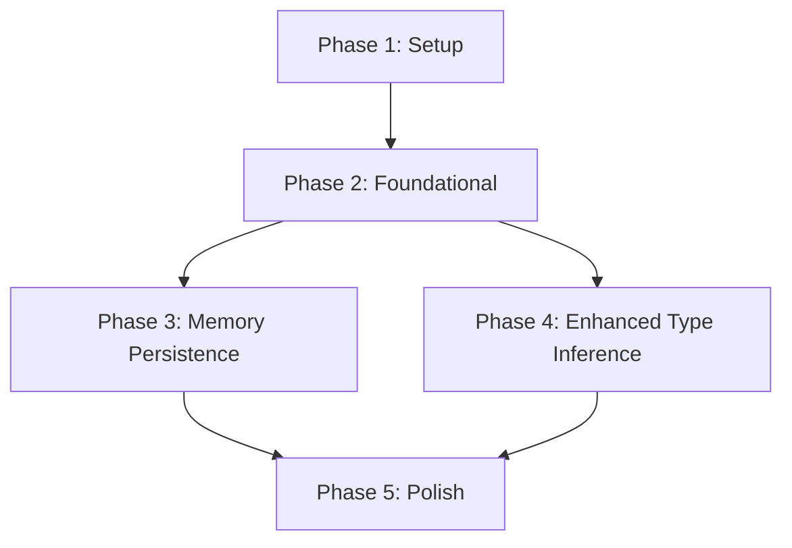

# Implementation Tasks: Jinja2 V2 Editor UX Optimization

**Feature**: Jinja2 V2 Editor UX Optimization
**Branch**: 003-jinja2-v2-editor-optimization
**Total Tasks**: 47
**Generated**: 2025-01-06

## Task Overview

- **Setup Phase**: 5 tasks
- **Foundational Phase**: 8 tasks
- **User Story 1 (Memory Persistence)**: 12 tasks
- **User Story 2 (Enhanced Type Inference)**: 14 tasks
- **Polish Phase**: 8 tasks

## Phase 1: Setup

**Goal**: Project initialization and infrastructure setup

- [X] T001 Create TypeScript interfaces for core data models in src/features/jinja2/ui/types/memory.ts
- [X] T002 Create TypeScript interfaces for enhanced variable types in src/features/jinja2/ui/types/enhanced-variable.ts
- [X] T003 Add configuration schema to package.json for new memory and inference settings
- [X] T004 Create directory structure for new test files in src/tests/unit/features/jinja2/
- [X] T005 Setup logging infrastructure for memory and inference operations in src/core/logging/memory-logger.ts

## Phase 2: Foundational

**Goal**: Implement core services that block user story implementation

- [X] T006 Implement template fingerprinting service in src/features/jinja2/ui/utils/template-fingerprinter.ts
- [X] T007 Implement variable serialization utilities in src/features/jinja2/ui/utils/variable-serializer.ts
- [X] T008 Create variable memory storage service in src/features/jinja2/ui/utils/variable-memory-service.ts
- [X] T009 [P] Implement enhanced template parser with control structure analysis in src/features/jinja2/ui/utils/enhanced-template-parser.ts
- [X] T010 Implement contextual type inference engine in src/features/jinja2/ui/utils/type-inference-engine.ts
- [X] T011 [P] Create enhanced variable state manager base class in src/features/jinja2/ui/utils/enhanced-variable-state-manager.ts
- [X] T012 Add new message types to webview protocol in src/features/jinja2/ui/types/webview-messages.ts
- [X] T013 Implement memory cleanup and maintenance utilities in src/features/jinja2/ui/utils/memory-cleanup.ts

## Phase 3: User Story 1 - Memory Persistence

**Goal**: Users can see remembered variable values across editing sessions

**Independent Test Criteria**:
- Same template reopened within 24 hours shows all previous variable values
- Template modifications (minor changes) preserve variable value memory
- Users can clear remembered values for specific variables
- Performance impact is negligible (< 50ms additional load time)

- [X] T014 [US1] Enhance Jinja2NunjucksProcessor with template fingerprinting in src/features/jinja2/processor.ts
- [X] T015 [US1] Integrate memory service into VariableStateManager in src/features/jinja2/ui/utils/variable-state-manager.ts
- [X] T016 [US1] Add memory persistence methods to VariableStateManager in src/features/jinja2/ui/utils/variable-state-manager.ts
- [ ] T017 [P] [US1] Update jinja2-editor-v2.ts with memory indicators in src/features/jinja2/ui/components/jinja2-editor-v2.ts
- [ ] T018 [P] [US1] Update variable-popover.ts with memory display in src/features/jinja2/ui/components/variable-popover.ts
- [ ] T019 [US1] Add memory-related CSS styles to variable-popover.ts in src/features/jinja2/ui/components/variable-popover.ts
- [ ] T020 [US1] Enhance webview.ts with memory message handlers in src/features/jinja2/webview.ts
- [ ] T021 [US1] Update command-handler.ts with memory coordination in src/features/jinja2/command-handler.ts
- [ ] T022 [P] [US1] Create unit tests for variable memory service in src/tests/unit/features/jinja2/variable-memory-service.test.ts
- [ ] T023 [P] [US1] Create unit tests for template fingerprinting in src/tests/unit/features/jinja2/template-fingerprinting.test.ts
- [ ] T024 [US1] Create integration tests for memory persistence in src/tests/integration/jinja2-memory-persistence.test.ts
- [ ] T025 [US1] Create UI tests for memory indicators in src/tests/unit/ui/components/variable-popover.test.ts

## Phase 4: User Story 2 - Enhanced Type Inference

**Goal**: Variables are assigned correct types automatically based on contextual analysis

**Independent Test Criteria**:
- Boolean inference accuracy > 90% for `` contexts
- Array/list inference accuracy > 85% for `` contexts
- String/numeric inference from literal assignments > 95% accuracy
- Users can easily override inferred types with manual selection
- Confidence scores accurately reflect inference reliability

- [ ] T026 [US2] Implement contextual type inference functions in src/features/jinja2/ui/utils/variable-utils.ts
- [ ] T027 [US2] Add control structure analysis to template parser in src/features/jinja2/ui/utils/template-parser.ts
- [ ] T028 [US2] Enhance type inference engine with contextual analysis in src/features/jinja2/ui/utils/type-inference-engine.ts
- [ ] T029 [P] [US2] Update variable-popover.ts with confidence indicators in src/features/jinja2/ui/components/variable-popover.ts
- [ ] T030 [P] [US2] Update jinja2-editor-v2.ts with type inference display in src/features/jinja2/ui/components/jinja2-editor-v2.ts
- [ ] T031 [US2] Add confidence scoring CSS styles to variable-popover.ts in src/features/jinja2/ui/components/variable-popover.ts
- [ ] T032 [US2] Implement manual type override functionality in src/features/jinja2/ui/components/variable-popover.ts
- [ ] T033 [US2] Enhance webview.ts with type inference message handlers in src/features/jinja2/webview.ts
- [ ] T034 [US2] Update command-handler.ts with type inference coordination in src/features/jinja2/command-handler.ts
- [ ] T035 [US2] Add inference results to EnhancedVariable interface in src/features/jinja2/ui/types/enhanced-variable.ts
- [ ] T036 [P] [US2] Create unit tests for enhanced type inference in src/tests/unit/features/jinja2/enhanced-type-inference.test.ts
- [ ] T037 [P] [US2] Create unit tests for control structure analysis in src/tests/unit/features/jinja2/control-structure-analysis.test.ts
- [ ] T038 [US2] Create integration tests for type inference in src/tests/integration/jinja2-type-inference.test.ts
- [ ] T039 [US2] Create UI tests for confidence indicators in src/tests/unit/ui/components/jinja2-editor-v2.test.ts

## Phase 5: Polish & Cross-Cutting Concerns

**Goal**: Finalize implementation, optimize performance, and ensure quality

- [ ] T040 Add comprehensive error handling and fallback mechanisms to variable-memory-service.ts
- [ ] T041 Implement performance optimizations for template fingerprinting in template-fingerprinter.ts
- [ ] T042 Add storage quota management and cleanup to memory-cleanup.ts
- [ ] T043 Implement configuration validation and default settings handling in src/features/jinja2/ui/utils/config-validator.ts
- [ ] T044 Add telemetry and usage analytics for memory and inference features in src/core/telemetry/memory-telemetry.ts
- [ ] T045 Create comprehensive documentation and inline code comments
- [ ] T046 [P] Add end-to-end tests for complete user workflows in src/tests/e2e/jinja2-v2-optimization.e2e.test.ts
- [ ] T047 Performance testing and optimization validation

## Dependencies



**Story Dependencies**:
- User Story 1 (Memory Persistence) and User Story 2 (Enhanced Type Inference) are **independent** and can be developed in parallel after foundational phase
- Both stories depend on the foundational services (T006-T013)

## Parallel Execution Opportunities

### Within User Story 1 (Memory Persistence):
```bash
# Parallel tasks (can be executed simultaneously):
T017 - Update jinja2-editor-v2.ts with memory indicators
T018 - Update variable-popover.ts with memory display
T022 - Create unit tests for variable memory service
T023 - Create unit tests for template fingerprinting
```

### Within User Story 2 (Enhanced Type Inference):
```bash
# Parallel tasks (can be executed simultaneously):
T029 - Update variable-popover.ts with confidence indicators
T030 - Update jinja2-editor-v2.ts with type inference display
T036 - Create unit tests for enhanced type inference
T037 - Create unit tests for control structure analysis
```

## Implementation Strategy

### MVP Scope (Phase 3 Only)
**Minimum Viable Product**: Implement just User Story 1 (Memory Persistence) to deliver immediate user value:
- Tasks T014-T025 provide complete memory persistence functionality
- Users will see remembered values when reopening templates
- Performance impact minimized through efficient fingerprinting
- Clear visual indicators for remembered values

### Incremental Delivery Strategy
1. **Sprint 1**: Complete Phase 1+2 (Setup + Foundational) - 13 tasks
2. **Sprint 2**: Complete User Story 1 (Memory Persistence) - 12 tasks
3. **Sprint 3**: Complete User Story 2 (Enhanced Type Inference) - 14 tasks
4. **Sprint 4**: Complete Polish Phase - 8 tasks

### Risk Mitigation Strategy
- **Performance Risk**: Implement performance testing early (T047) and optimize in parallel
- **Storage Risk**: Implement quota management and cleanup early (T044)
- **Compatibility Risk**: Extensive integration tests (T024, T038) to ensure no regressions
- **User Adoption Risk**: Focus on intuitive UI indicators and clear visual feedback

## Quality Gates

### Entry Criteria for Each Phase
- **Phase 1**: All interfaces and configuration defined
- **Phase 2**: Core services implemented with basic functionality
- **Phase 3-4**: All user stories have passing unit and integration tests
- **Phase 5**: Performance benchmarks met and error handling complete

### Exit Criteria
- All acceptance criteria from spec.md met
- Performance goals achieved (<100ms fingerprinting, <50ms storage)
- Backward compatibility maintained with existing V2 editor
- Code coverage >90% for new functionality
- User acceptance testing completed

## Task Labels Legend

- **[P]**: Parallelizable - can be executed with other [P] tasks
- **[US1]**: User Story 1 - Memory Persistence
- **[US2]**: User Story 2 - Enhanced Type Inference

This task breakdown provides a clear, executable path for implementing the Jinja2 V2 Editor UX Optimization while maintaining code quality and delivering user value incrementally.